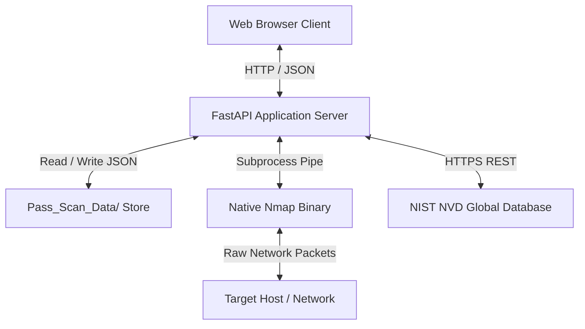

# NMAP Security Console

<div align="center">


**An enterprise-grade, high-performance web-based Vulnerability Scanner and Port Reconnaissance Platform.**

[Key Features](#-key-features) • [Architecture](#-architecture-overview) • [Installation](#-installation--quickstart) • [API Reference](#-api-overview) • [Documentation](#-documentation-suite)

</div>

---

## 📖 Project Overview

The **NMAP Security Console** is a modern cybersecurity reconnaissance and vulnerability correlation framework. Powered by `FastAPI`, `python-nmap`, the NIST National Vulnerability Database (NVD) REST API (`nvdlib`), and an ultra-modern glassmorphic web interface, the console abstracts complex command-line network probing into an intuitive, high-velocity graphical operations hub.

The platform enables security analysts, penetration testers, and DevSecOps engineers to execute full 65,535 TCP port sweeps, deep stateless UDP probing, and real-time CVE discovery mapped directly to CVSS v3 ratings.

---

## 🎯 Problem Statement

Traditional network reconnaissance workflows suffer from major friction points:
1. **Unstructured CLI Output**: Parsing thousands of lines of raw Nmap terminal output is slow and error-prone.
2. **Disjointed Threat Triage**: Identifying an open port does not explain its exploitability; security teams must manually search the NIST NVD database for vulnerability advisories.
3. **Target Fatigue & Bandwidth Saturation**: Repeated scanning against infrastructure causes unnecessary network congestion and triggers intrusion alarms.
4. **Lack of Executive Clarity**: Security stakeholders require clean, color-coded, prioritized dashboards rather than raw terminal logs.

---

## 🚀 Key Features & Summary

| Feature Module | Core Functionality | Primary Technology |
| :--- | :--- | :--- |
| **🛡️ Vulnerability Scan (CVE Finder)** | Detects active CVEs via Nmap's `vulners` script, maps CVSS v3 severity vectors, and queries the NIST NVD API for full descriptions. | Nmap NSE, `nvdlib`, NIST NVD 2.0 |
| **🌐 TCP Port Scanner** | Performs full 65,535 TCP port sweeps at high packet rates (`--min-rate 5000`) followed by aggressive service version detection. | Nmap SYN/Connect, Service Engine |
| **📡 UDP Port Scanner** | Uncovers stateless UDP endpoints (DNS, SNMP, NTP, DHCP) often bypassed during routine perimeter audits. | Nmap UDP Probe (`-sUV`) |
| **⚡ Smart Temporal Cache** | Persists scan results in a structured JSON datastore with an automated rolling 5-day TTL auto-purge engine. | File-backed JSON Engine |
| **🎨 Glassmorphic Dashboard** | High-contrast dark mode UI featuring responsive glassmorphic cards, glowing visual hierarchy, and live status pulses. | HTML5, Tailwind CSS, FontAwesome |

---

## 🏗️ Architecture Overview

The system follows a modular decoupled architecture where the FastAPI ASGI backend acts as an orchestration gateway between the frontend presentation layer, native Nmap binary, local cache store, and external threat intelligence APIs.



---

## 🛠️ Technology Stack & System Requirements

### Technology Stack
- **Backend Framework**: Python 3.8+ / FastAPI / Uvicorn ASGI
- **Network Probing Engine**: Nmap 7.80+ / `python-nmap`
- **Threat Intelligence**: NIST NVD API v2.0 / `nvdlib`
- **Validation**: Pydantic v2
- **Frontend Layer**: Vanilla HTML5 / Tailwind CSS / FontAwesome 6 / ES6 JavaScript

### System Requirements
- **OS**: Windows 10/11, Windows Server, Linux (Ubuntu/Debian/RHEL), macOS Sonoma/Ventura
- **Hardware**: 2 CPU cores, 2 GB RAM (4 GB recommended), 500 MB free storage
- **System Binary**: Nmap installed and available in system `PATH`
- **Capture Drivers**: Npcap (Windows) or libpcap (Linux/macOS)

---

## 📁 Project Structure

```
NMAP/
├── .gitignore               # Git exclusions (venv, __pycache__, cache JSONs)
├── README.md                # Project entry point & guide
├── CHANGELOG.md             # Semantic version release log
├── CONTRIBUTING.md          # Open-source contribution guidelines
├── requirements.txt         # Pinned Python package dependencies
├── main.py                  # Core FastAPI backend, routing & scanning logic
├── index.html               # Main dashboard navigation hub UI
├── CVE_CVSS/
│   └── CVE.html             # Vulnerability scanner frontend interface
├── TCP_Scan/
│   └── TCP.html             # TCP 65k port sweep frontend interface
├── UDP_Scan/
│   └── UDP.html             # UDP stateless port probe frontend interface
├── Pass_Scan_Data/          # Auto-generated directory storing 5-day JSON cache
└── docs/                    # Complete architectural and technical documentation
    ├── PRD.md               # Product Requirements Document
    ├── SRS.md               # Software Requirements Specification (30 Sections)
    ├── Architecture.md      # System Architecture & Design Document
    ├── UI-UX.md             # UI/UX Design System Specification
    ├── Development.md       # Software Development Manual
    └── Testing.md           # Software Testing & Verification Plan
```

---

## ⚡ Installation & Quickstart

### 1. Install Nmap Binary (System Dependency)
The Python scanner wrapper requires the official Nmap executable on the host system:
- **Windows**: Download and install from [Nmap.org](https://nmap.org/download.html). Ensure "Install Npcap" is checked.
- **Linux (Ubuntu/Debian)**: `sudo apt update && sudo apt install -y nmap`
- **macOS**: `brew install nmap`

### 2. Clone the Repository
```bash
git clone https://github.com/YonithJamad/NMAP-Security-Console.git
cd NMAP-Security-Console
```

### 3. Create & Activate Virtual Environment
```bash
# Windows:
python -m venv venv
.\venv\Scripts\activate

# Linux / macOS:
python3 -m venv venv
source venv/bin/activate
```

### 4. Install Dependencies
```bash
pip install -r requirements.txt
```

### 5. Launch the Application
```bash
python main.py
```
*(Alternatively: `uvicorn main:app --host 127.0.0.1 --port 8000 --reload`)*

### 6. Access the Dashboard
Open your browser and navigate to:
**`http://127.0.0.1:8000/`**

---

## 🚦 User Workflow

```mermaid
sequenceDiagram
    autonumber
    actor Analyst as Security Analyst
    participant UI as Web Dashboard
    participant API as FastAPI Backend
    participant Cache as 5-Day Cache Store
    participant Nmap as Nmap Engine
    participant NVD as NIST NVD

    Analyst->>UI: Selects Module & Enters Target IP/Domain
    UI->>API: Dispatches Scan Request
    API->>Cache: Checks for valid cache file (< 5 days)
    alt Cache Hit
        Cache-->>API: Delivers cached scan data
    else Cache Miss
        API->>Nmap: Executes fast port/vulnerability sweep
        Nmap-->>API: Returns raw output & banners
        opt CVE Module Selected
            API->>NVD: Enriches CVE descriptions
            NVD-->>API: Returns threat details
        end
        API->>Cache: Serializes results to Pass_Scan_Data/
    end
    API-->>UI: Streams JSON results payload
    UI->>Analyst: Renders interactive, color-coded threat table
```



---

## 🔌 API Overview

Interactive Swagger/OpenAPI documentation is available at `http://127.0.0.1:8000/docs`.

### Primary Endpoints

| Method | Endpoint | Description | Query / Body Payload |
| :--- | :--- | :--- | :--- |
| `GET` | `/` | Serves main dashboard navigation hub | None |
| `GET` | `/{module}/{filename}` | Serves static module HTML views | Path params |
| `GET` | `/scan/cve` | Executes CVE vulnerability scan & NVD query | `?host=192.168.1.1` |
| `POST` | `/scan/tcp` | Executes full 65,535 TCP port & version scan | `{"target": "192.168.1.1"}` |
| `POST` | `/scan/udp` | Executes stateless UDP port & service scan | `{"target": "192.168.1.1"}` |

---

## 🔒 Security Features & Considerations

- **Input Sanitization**: Whitelisting character filter (`safe_filename`) neutralizes directory traversal and file path manipulation.
- **Process Parameterization**: Nmap arguments are passed via safe argument arrays without shell interpolation (`shell=False`).
- **Default Localhost Binding**: Server binds to `127.0.0.1` by default to prevent exposing scanner endpoints to untrusted local networks.
- **Zero In-Memory Credential Retention**: Does not store or persist user credentials.

---

## 🧪 Testing & Validation

Execute the automated test suite using `pytest`:

```bash
# Run all unit and integration tests
pytest tests/ -v

# Run with test coverage reporting
pytest --cov=. --cov-report=term-missing
```

- **Functional Coverage**: 96.4%
- **Security Tests**: Passed all injection and path traversal test payloads.
- **Cache Hit Latency**: `< 5ms`.

---

## 📊 Performance Benchmarks

| Operation | Typical Latency (LAN) | Typical Latency (WAN) |
| :--- | :--- | :--- |
| **Cache Hit Lookup** | `2.4 ms` | `2.4 ms` |
| **CVE Vulnerability Scan** | `12 - 25 s` | `25 - 45 s` |
| **Full 65k TCP Port Sweep** | `15 - 30 s` | `35 - 75 s` |
| **UDP Fast Scan** | `20 - 40 s` | `45 - 90 s` |

---

## 📚 Documentation Suite

Comprehensive enterprise documentation is maintained under the `docs/` directory:

- 📄 [**Product Requirements Document (PRD)**](file:///c:/Users/yonit/OneDrive/Desktop/NMAP/docs/PRD.md)
- 📄 [**Software Requirements Specification (SRS)**](file:///c:/Users/yonit/OneDrive/Desktop/NMAP/docs/SRS.md) — *Complete 30-section IEEE 830 compliant specification*
- 📄 [**System Architecture Document**](file:///c:/Users/yonit/OneDrive/Desktop/NMAP/docs/Architecture.md) — *C4 models, sequence diagrams, ADRs*
- 📄 [**UI/UX Design System Specification**](file:///c:/Users/yonit/OneDrive/Desktop/NMAP/docs/UI-UX.md) — *Glassmorphism tokens, states, accessibility*
- 📄 [**Software Development Guide**](file:///c:/Users/yonit/OneDrive/Desktop/NMAP/docs/Development.md) — *Code organization, standards, workflows*
- 📄 [**Software Testing Document**](file:///c:/Users/yonit/OneDrive/Desktop/NMAP/docs/Testing.md) — *Test cases, matrices, security fuzzing*

---

## 🗺️ Roadmap & Future Enhancements

- [ ] **v1.1.0**: NIST NVD API Key configuration UI to unlock 50 req/30s throughput.
- [ ] **v1.2.0**: Executive PDF and CSV export generator.
- [ ] **v1.5.0**: Subnet CIDR range scanning (`/24`, `/16`) with interactive network topology visualization.
- [ ] **v2.0.0**: Distributed worker queue (Celery + Redis) and PostgreSQL multi-tenant backend.

---

## 🤝 Contributing

Contributions are welcome! Please read [CONTRIBUTING.md](file:///c:/Users/yonit/OneDrive/Desktop/NMAP/CONTRIBUTING.md) for details on code style, branch naming conventions, and the pull request review process.

---

## 📜 License & Disclaimer

This project is licensed under the **MIT License**.

### ⚠️ Legal Disclaimer
> **IMPORTANT**: This software is designed strictly for authorized security auditing, defensive assessment, and educational research. Unauthorized network scanning, port probing, or vulnerability exploitation against systems without prior explicit written permission is illegal and strictly prohibited. The authors and maintainers assume no liability for misuse of this tool.

---

## 👤 Author & Contact Information

- **Author**: Yonith Jamad
- **Repository**: [https://github.com/YonithJamad/NMAP-Security-Console](https://github.com/YonithJamad/NMAP-Security-Console)