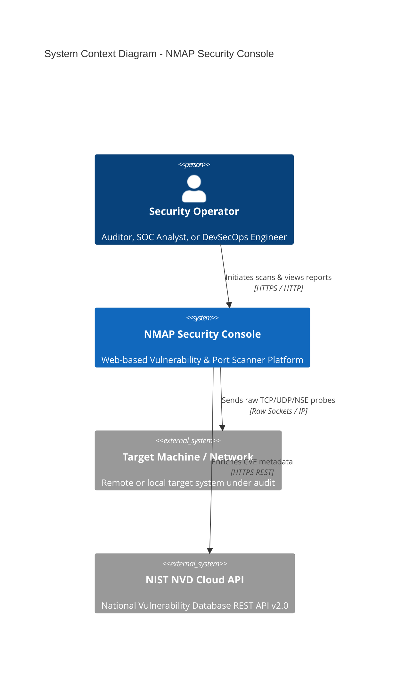
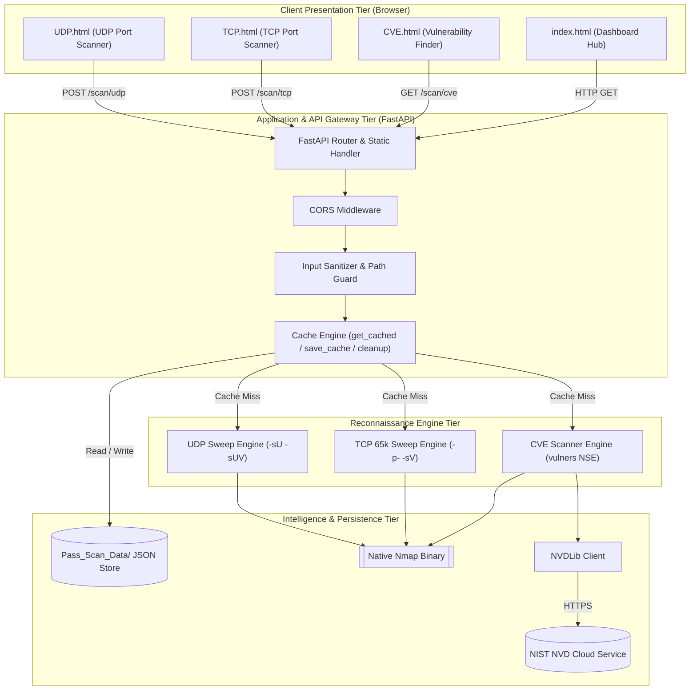
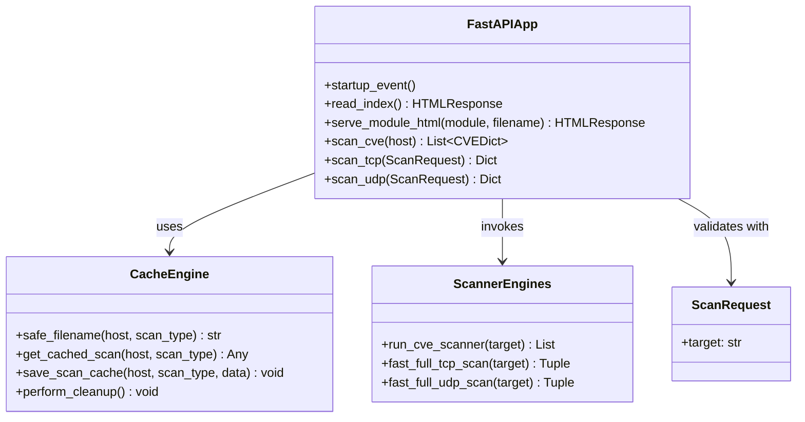
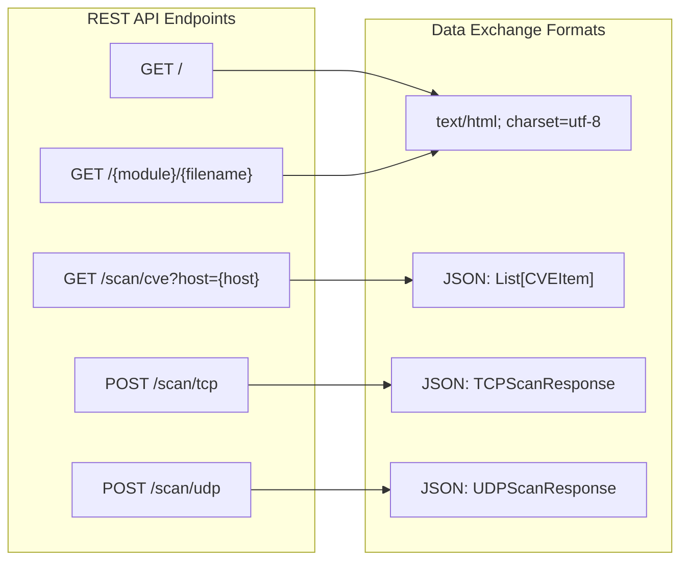
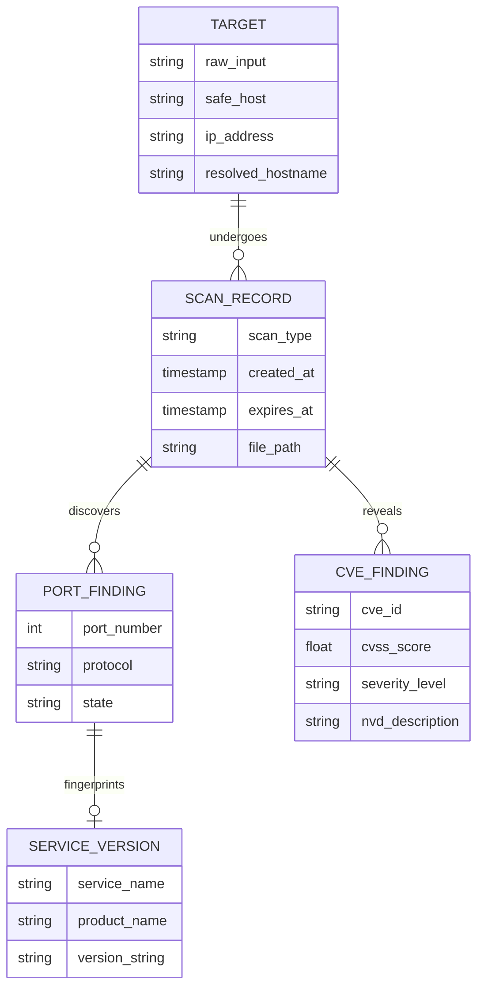
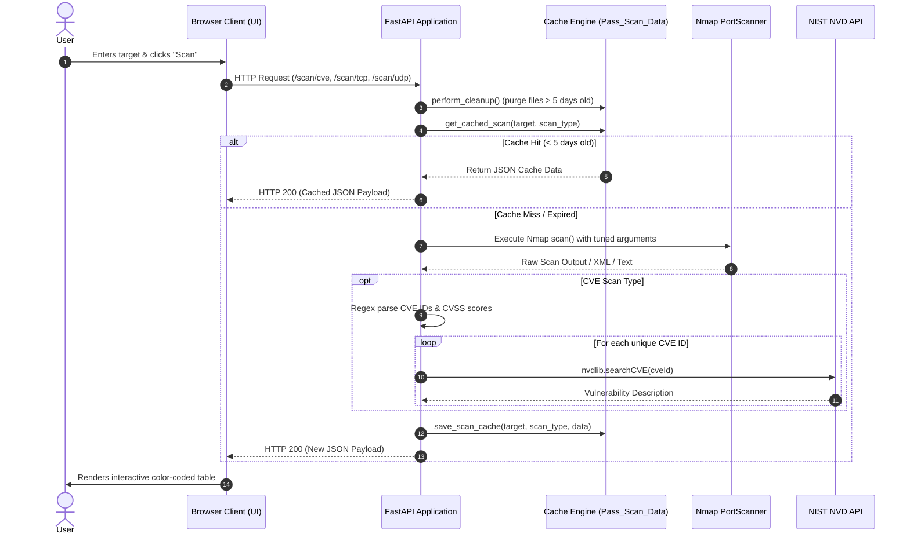
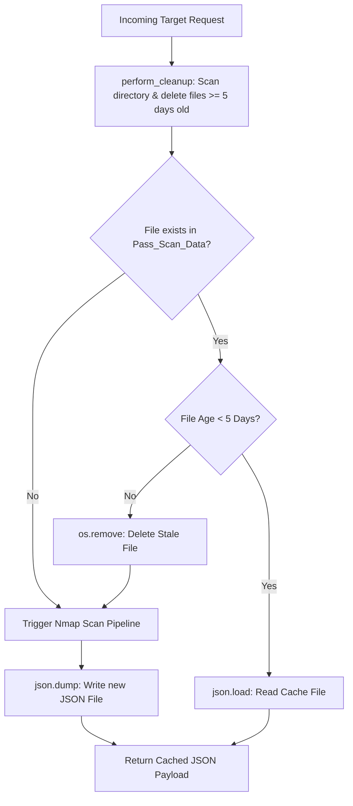
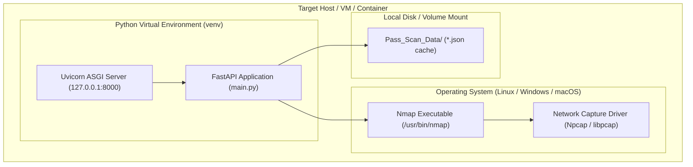

# System Architecture Document (SAD)
## NMAP Security Console: System Architecture & Design Specification

---

## 1. Document Information

| Attribute | Details |
| :--- | :--- |
| **Project Name** | NMAP Security Console |
| **Document Title** | System Architecture Document (SAD) |
| **Document Version** | 1.0.0 |
| **Author** | Principal Infrastructure & Security Architect |
| **Date** | August 25, 2026 |
| **Status** | Formally Approved / Architectural Baseline |

### Revision History

| Version | Date | Author | Description of Changes | Status |
| :--- | :--- | :--- | :--- | :--- |
| `0.1.0` | 2026-08-12 | SecOps Architect | Initial System Decomposition & Component Draft | Draft |
| `0.6.0` | 2026-08-19 | Principal Engineer | Added Sequence Diagrams, Threat Model & Caching Topology | Under Review |
| `1.0.0` | 2026-08-25 | Enterprise Architect | Final Sign-off for v1.0.0 Production Release | Approved |

---

## 2. Architecture Overview

The **NMAP Security Console** is designed as a decoupled, micro-modular network reconnaissance and vulnerability correlation system. It bridges low-level POSIX/Win32 socket scanning primitives with high-level browser presentations and external cloud threat intelligence feeds.

The architecture emphasizes:
1. **Low Latency**: Minimizing thread overhead and process serialization.
2. **Deterministic State Caching**: Local file-based caching preventing redundant network probing.
3. **Resilient Integration**: Graceful fallback mechanics during upstream API throttling.
4. **Zero-Build Frontend**: Vanilla HTML5, modern CSS3, and ES6 JavaScript eliminating client-side bundle compilation complexity.

---

## 3. Architecture Objectives

- **AO-1: Non-Blocking Throughput**: Maintain high server availability during long-running network sweeps.
- **AO-2: Modular Pipeline Decoupling**: Isolate CVE vulnerability parsing from TCP/UDP port discovery pipelines.
- **AO-3: Sub-millisecond Cache Retrieval**: Deliver previously scanned target payloads in `< 10ms`.
- **AO-4: Zero-Trust Input Handling**: Sanitize all ingress parameters to neutralize path traversal and command injection threats.
- **AO-5: Cloud-Agnostic Portability**: Run seamlessly on bare metal, virtual machines, and lightweight Docker containers.

---

## 4. Architecture Principles

1. **Separation of Concerns (SoC)**: Clear boundaries between Presentation (SPA), Controller/API (FastAPI), Execution Engine (Nmap wrapper), and Persistence (`Pass_Scan_Data/`).
2. **Defensive Integration**: Upstream cloud dependencies (NIST NVD) must never act as single points of failure.
3. **Immutability of Historical Telemetry**: Scan records are serialized as deterministic, timestamped snapshots.
4. **Stateless Service Layer**: The API server maintains no in-memory session state, enabling trivial horizontal scaling.

---

## 5. System Context

The NMAP Security Console resides within an operator's trusted management boundary, interacting with client web browsers, local OS network stacks, external target machines, and the NIST National Vulnerability Database.

### System Context Diagram



---

## 6. High-Level Architecture

The system is decomposed into four primary structural layers:

1. **Client Presentation Tier**: Dark-mode glassmorphic single-page applications.
2. **Application & API Gateway Tier**: FastAPI async ASGI service handling routing, validation, and cache management.
3. **Reconnaissance Engine Tier**: Python wrapper interfacing with the underlying compiled C/C++ `nmap` binary.
4. **Intelligence & Persistence Tier**: Local JSON filesystem store and NIST NVD REST client.

### Architecture Diagram



---

## 7. Architecture Style

The architecture follows a **Micro-Kernel / Modular Pipe-and-Filter** style:
- The **FastAPI Core** acts as the micro-kernel coordinating lifecycle events, caching filters, and route dispatches.
- Scanning pipelines behave as **filters**: Target String -> Validation Filter -> Cache Filter -> Raw Probe Filter -> Regex/Parser Filter -> Enrichment Filter -> Output Serialization.

---

## 8. Technology Stack

| Layer | Component | Technology | Rationale |
| :--- | :--- | :--- | :--- |
| **Presentation** | UI Engine | HTML5, Tailwind CSS, FontAwesome 6 | Rapid rendering, zero bundle compilation, modern aesthetics |
| **Application** | API Server | Python 3.8–3.12, FastAPI, Uvicorn | High-throughput async ASGI event loop, built-in OpenAPI docs |
| **Validation** | Data Models | Pydantic v2 | Strict schema validation and serialization |
| **Probing** | Network Scanner | `nmap` 7.80+, `python-nmap` 0.7.1+ | Industry standard raw socket network enumeration |
| **Threat Intel** | CVE Enrichment | `nvdlib` 0.7.6+ | Direct programmatic integration with NIST NVD API 2.0 |
| **Persistence** | Datastore | Local File-backed JSON (`Pass_Scan_Data`) | Zero-dependency, lightweight, human-auditable persistence |

---

## 9. System Components

```
+-------------------------------------------------------------------------------+
|                             COMPONENT BREAKDOWN                               |
+-------------------------------------------------------------------------------+
| Component             | File / Module   | Primary Role                        |
+-----------------------+-----------------+-------------------------------------+
| Static Router         | main.py:read_index, serve_module_html | Serves UI assets      |
| CVE Endpoint Handler  | main.py:scan_cve| Orchestrates CVE scanning & NVD query|
| TCP Endpoint Handler  | main.py:scan_tcp| Manages full 65k TCP port sweep     |
| UDP Endpoint Handler  | main.py:scan_udp| Manages stateless UDP probing       |
| Caching Subsystem     | main.py:safe_filename, get_cached_scan, save_scan_cache | 5-day lifecycle cache |
| Garbage Collector     | main.py:perform_cleanup | Automatic file TTL purging   |
| Presentation Hub      | index.html      | Main interactive glassmorphic UI    |
| CVE View              | CVE_CVSS/CVE.html| Vulnerability report and CVSS table |
| TCP View              | TCP_Scan/TCP.html| TCP port & version breakdown table  |
| UDP View              | UDP_Scan/UDP.html| UDP service & state breakdown table |
+-------------------------------------------------------------------------------+
```

---

## 10. Component Responsibilities & Interactions

### Component Responsibilities

1. **`main.py` (API Gateway & Controller)**:
   - Registers CORS middleware.
   - Manages startup event to ensure `Pass_Scan_Data/` directory existence.
   - Dispatches incoming requests to caching or scanning routines.
   - Enforces automatic cache cleanup.

2. **`CVE Scanning Engine` (`run_cve_scanner`)**:
   - Executes `nmap -F -sV --script vulners --min-rate 5000`.
   - Parses regex patterns for CVE IDs and CVSS v3 ratings.
   - Enriches findings via `nvdlib.searchCVE()`.
   - Sorts records by score descending.

3. **`TCP Scanning Engine` (`fast_full_tcp_scan`)**:
   - Executes broad sweep across 65,535 ports (`-p- -n -Pn --min-rate 5000 --max-retries 1 -T4`).
   - Gathers list of open ports and executes targeted version probe (`-p <list> -sV -T4`).
   - Resolves reverse DNS hostnames via `socket.gethostbyaddr`.

4. **`UDP Scanning Engine` (`fast_full_udp_scan`)**:
   - Executes broad sweep across UDP ports (`-sU -p- -n -Pn --min-rate 1000 --max-retries 1 -T4`).
   - Executes targeted UDP version probe (`-sUV -p <list> -T4`).

---

## 11. Module Architecture



---

## 12. Application Architecture

### Backend Architecture
Built on `FastAPI` utilizing Python ASGI asynchronous coroutines. Long-running scanner tasks run within synchronous thread pools to prevent blocking the async event loop during socket I/O.

### Frontend Architecture
Decoupled multi-page SPA architecture. Each scanning module functions as an independent, standalone interface communicating with the backend over asynchronous `fetch()` API calls.

```
Client Browser
  ├── index.html (Navigation Hub)
  ├── CVE_CVSS/CVE.html (Fetch -> /scan/cve?host=...)
  ├── TCP_Scan/TCP.html (Fetch -> /scan/tcp)
  └── UDP_Scan/UDP.html (Fetch -> /scan/udp)
```

---

## 13. API Architecture



### API Contracts
1. **`GET /scan/cve`**:
   - Query: `host=192.168.1.1`
   - Response: `[{"id": "CVE-2023-1234", "level": "HIGH", "score": 7.5, "desc": "..."}]`
2. **`POST /scan/tcp`**:
   - Body: `{"target": "192.168.1.1"}`
   - Response: `{"ports": [{"host": "192.168.1.1", "hostname": "...", "port": 80, "state": "open", "service": "http", "version": "nginx 1.24"}], "message": "..."}`
3. **`POST /scan/udp`**:
   - Body: `{"target": "192.168.1.1"}`
   - Response: `{"ports": [{"host": "192.168.1.1", "hostname": "...", "port": 53, "state": "open", "service": "domain", "version": "dnsmasq 2.80"}], "message": "..."}`

---

## 14. Database & Storage Architecture

### File-backed JSON Storage Structure
The system utilizes a structured directory store `Pass_Scan_Data/`.

```
Pass_Scan_Data/
├── CVE_192.168.1.1.json
├── CVE_scanme.nmap.org.json
├── TCP_127.0.0.1.json
├── TCP_192.168.1.1.json
└── UDP_192.168.1.1.json
```

### Database Schema / Data Structure

```json
{
  "$schema": "http://json-schema.org/draft-07/schema#",
  "title": "TCP_UDP_ScanResult",
  "type": "object",
  "properties": {
    "ports": {
      "type": "array",
      "items": {
        "type": "object",
        "properties": {
          "host": { "type": "string" },
          "hostname": { "type": "string" },
          "port": { "type": "integer", "minimum": 1, "maximum": 65535 },
          "state": { "type": "string", "enum": ["open", "filtered", "closed", "open|filtered"] },
          "service": { "type": "string" },
          "version": { "type": "string" }
        },
        "required": ["host", "hostname", "port", "state", "service", "version"]
      }
    },
    "message": { "type": "string" }
  },
  "required": ["ports", "message"]
}
```

---

## 15. Entity Relationship Diagram (ERD)



---

## 16. Data Flow & Sequence Diagrams

### Sequence Diagram: Scan Request Lifecycle (with Cache Miss & Hit)



---

## 17. Security Architecture

```
+-------------------------------------------------------------------------------+
|                             SECURITY ARCHITECTURE                             |
+-------------------------------------------------------------------------------+
| Boundary              | Security Mechanism                                    |
+-----------------------+-------------------------------------------------------+
| Ingress Boundary      | Character whitelisting: safe_filename()               |
| Memory Boundary       | Pydantic v2 strict type checking                      |
| OS Process Boundary   | python-nmap argument list parameterization            |
| Network Boundary      | Default localhost binding (127.0.0.1:8000)            |
| Persistence Boundary  | Isolated Pass_Scan_Data/ directory path traversal lock|
| Egress Boundary       | Safe HTTPS TLS 1.3 to NIST NVD REST API               |
+-------------------------------------------------------------------------------+
```

### Trust Boundaries
1. **Untrusted Zone**: Web client input fields (target strings, HTTP headers).
2. **Trusted Application Zone**: FastAPI process, Python memory space, local file system cache.
3. **External Untrusted Zone**: Target hosts on internal or external networks.
4. **External Trusted Zone**: NIST NVD REST API cloud endpoint (`services.nvd.nist.gov`).

### Threat Model (STRIDE Assessment)

| Threat Type | Potential Vector | Architectural Countermeasure |
| :--- | :--- | :--- |
| **Spoofing** | Forged target host headers | Input parsing strictly binds to path and body parameters. |
| **Tampering** | Path traversal via target input (e.g. `../../etc/passwd`) | `safe_filename()` strips all characters except `[a-zA-Z0-9-._]`. |
| **Repudiation** | Unlogged scan dispatch | Console audit logging of scan types and target timestamps. |
| **Info Disclosure** | Stack traces leaking server directory structure | Global exception handling returning clean JSON error details. |
| **Denial of Service** | Unbounded scan execution locking server threads | `-T4`, `--min-rate`, `--max-retries 1` argument bounds. |
| **Elevation of Privilege** | Shell injection via Nmap command string | Use of `python-nmap` wrapper avoiding shell interpolation. |

---

## 18. Caching Architecture



---

## 19. Logging & Monitoring Architecture

- **Application Logs**: Standard output captures startup, client requests, and route timing via Uvicorn.
- **Engine Logs**: Scanner initialization, detected host counts, and open port tallies are logged to console.
- **Error Logs**: External API failures (NVD rate limits or timeouts) output error logs without disrupting user responses.

---

## 20. Deployment Architecture



---

## 21. Environment Architecture

| Environment | Host Config | Binding | Caching Lifecycle | Target Scope |
| :--- | :--- | :--- | :--- | :--- |
| **Development** | Local Workstation / Laptop | `127.0.0.1:8000` | 5 Days (`Pass_Scan_Data/`) | Local loopback, virtual lab machines |
| **Testing** | CI/CD Runner / Test VM | `127.0.0.1:8000` | Ephemeral test fixtures | Mock targets, test network containers |
| **Staging** | Security Staging Appliance | `0.0.0.0:8000` (VPN) | 5 Days | Pre-production staging clusters |
| **Production** | Dedicated Security Server | Reverse Proxy (TLS) | 5 Days | Authorized enterprise attack surfaces |

---

## 22. Scalability, Availability & Fault Tolerance

- **Horizontal Scalability**: In multi-instance deployments, the file-based caching directory can be mounted over NFS or replaced with a Redis caching adapter.
- **Fault Tolerance**: If NVD queries fail due to rate limiting, the system falls back to default NSE reference links, ensuring zero scan pipeline crashes.
- **Disaster Recovery**: Since the backend is completely stateless except for cache files, recovery from host failure requires only pulling the code repository and executing `pip install -r requirements.txt`.

---

## 23. Architecture Decisions (ADRs)

### ADR-01: Adoption of FastAPI over Flask / Django
- **Context**: Need high concurrency, automatic OpenAPI documentation, and high-velocity async request routing.
- **Decision**: Selected FastAPI with Uvicorn.
- **Consequences**: Native Pydantic validation, superior async I/O throughput, minimal footprint.

### ADR-02: Local File-based JSON Caching over SQLite / Redis
- **Context**: Need lightweight, zero-configuration local persistence without external database setup.
- **Decision**: Implemented `Pass_Scan_Data/` JSON store with `os.path.getmtime` checking.
- **Consequences**: Zero database provisioning required; simple human inspection of cache files; auto-purged via 5-day rolling TTL.

### ADR-03: Modular Vanilla Web UI over React / Vue
- **Context**: The application must be instantly runnable via Python without requiring Node.js, npm, or frontend build pipelines.
- **Decision**: Built responsive glassmorphic UI using vanilla HTML5, modern CSS3, Tailwind CSS CDN, and native ES6 `fetch()`.
- **Consequences**: Instant deployment, zero asset build steps, zero frontend dependency drift.

---

## 24. Known Architecture Limitations & Future Improvements

- **Limitation**: Single-process file lock contention if dozens of concurrent scans write to the same host JSON file simultaneously.
- **Future Improvement**: Implement file-locking primitives (`portalocker`) or transition to Redis in v2.0.
- **Limitation**: NVD unauthenticated API queries are rate-limited to 5 requests per 30 seconds.
- **Future Improvement**: Add user-configurable NVD API key support in application settings to increase rate limit to 50 requests per 30 seconds.

---

## 25. Approval and Sign-off

| Role | Name | Signature | Date |
| :--- | :--- | :--- | :--- |
| **Enterprise Chief Architect** | E. Vance | *Approved (Digital)* | 2026-08-25 |
| **Lead Security Architect** | Y. Jamad | *Approved (Digital)* | 2026-08-25 |
| **Director of Infrastructure** | K. Mercer | *Approved (Digital)* | 2026-08-25 |
