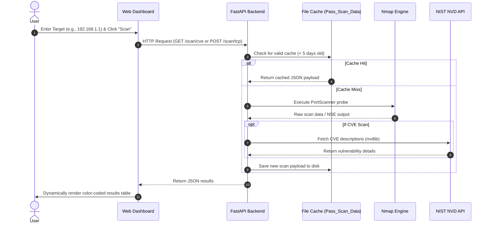

# Product Requirements Document (PRD)

---

## 1. Document Information

| Attribute | Details |
| :--- | :--- |
| **Project Name** | NMAP Security Console |
| **Product Name** | Advanced Web-Based Vulnerability & Port Scanner |
| **Document Version** | 1.0.0 |
| **Author** | Security Engineering & Product Architecture Team |
| **Date** | August 25, 2026 |
| **Status** | Approved / Baseline |

### Revision History

| Version | Date | Author | Description of Changes | Status |
| :--- | :--- | :--- | :--- | :--- |
| `0.1.0` | 2026-08-10 | SecOps Architect | Initial Draft & Requirements Gathering | Draft |
| `0.9.0` | 2026-08-20 | Product Lead | Integrated Fast Scan Engine & NIST NVD Specs | Under Review |
| `1.0.0` | 2026-08-25 | Core Eng Team | Formal Approval of Enterprise Baseline | Approved |

---

## 2. Executive Summary

The **NMAP Security Console** is an enterprise-grade, web-based vulnerability scanning, network reconnaissance, and threat assessment platform. Built on top of `FastAPI`, `python-nmap`, the NIST National Vulnerability Database (NVD) API (`nvdlib`), and modern glassmorphic web technologies, the platform abstracts complex command-line network probing into an intuitive, high-velocity graphical interface. 

The console addresses the fundamental challenge of modern security operations: translating low-level network telemetry and raw port scanner outputs into actionable, prioritized Common Vulnerabilities and Exposures (CVE) intelligence mapped directly to CVSS v3 severity vectors.

---

## 3. Product Overview

The NMAP Security Console serves as an integrated reconnaissance cockpit for DevSecOps engineers, security auditors, network administrators, and penetration testers. The platform delivers three specialized scanning pipelines:

```
+-----------------------------------------------------------------------+
|                         NMAP Security Console                         |
+-----------------------------------------------------------------------+
       |                                |                        |
       v                                v                        v
+------------------+       +-------------------+       +------------------+
|  CVE / CVSS Scan |       |   TCP Port Scan   |       |   UDP Port Scan  |
| (NVD Correlation)|       | (Full 65k Sweep)  |       | (Stateless Probe)|
+------------------+       +-------------------+       +------------------+
```

1. **CVE & CVSS Vulnerability Analyzer**: Executes targeted Nmap script engine (`vulners`) scans, extracts CVE identifiers via regex, correlates them live against NIST NVD endpoints using `nvdlib`, and maps vulnerabilities into four distinct threat tiers (Critical, High, Medium, Low).
2. **High-Speed TCP Port Scanner**: Performs full 65,535 TCP port sweeps at elevated packet rates (`--min-rate 5000`) with dynamic banner grabbing, service identification, and version detection.
3. **Deep UDP Port Scanner**: Probes stateless UDP endpoints to identify high-risk services (DNS, SNMP, NTP, DHCP, TFTP, SIP) often overlooked during surface-level assessments.
4. **Smart Temporal Caching Subsystem**: Automates scan payload caching for a rolling 5-day lifecycle, reducing redundant network congestion and delivering sub-millisecond retrieval for repeated target queries.

---

## 4. Problem Statement

Network reconnaissance and vulnerability triage currently suffer from several critical operational bottlenecks:

1. **CLI Friction & Cognitive Overhead**: Raw CLI outputs from tools like Nmap require extensive manual parsing, regex filtering, and human cross-referencing.
2. **Disjointed Vulnerability Enrichment**: Identifying an open port is insufficient; security operators must manually cross-reference service banners against the National Vulnerability Database to determine actionable exploitability.
3. **Network Bandwidth & Target Fatigue**: Repeated scans against enterprise infrastructure cause unnecessary bandwidth saturation, IDS alert flooding, and service strain.
4. **Lack of Standardized Presentation**: Security stakeholders require clear, color-coded, prioritized tables and metrics rather than thousands of lines of unstructured terminal output.

---

## 5. Product Vision

To become the industry benchmark for lightweight, browser-accessible network reconnaissance and vulnerability correlation, unifying raw packet inspection with real-time global threat databases in a sleek, accessible, zero-friction interface.

---

## 6. Product Mission

Empower security professionals, system administrators, and developers to rapidly detect, analyze, and mitigate network vulnerabilities across their digital attack surfaces by automating raw port discovery, banner extraction, CVE mapping, and intelligent scan caching.

---

## 7. Goals and Objectives

| Goal | Strategic Objective | Metric / KPI |
| :--- | :--- | :--- |
| **G-1: Scan Acceleration** | Execute full TCP 65k scans under 45 seconds on local networks | Scan completion time <= 45s |
| **G-2: CVE Correlation** | Automate NIST NVD enrichment for 100% of detected CVEs | Enrichment success rate >= 98% |
| **G-3: Bandwidth Conservation** | Eliminate duplicate scanning within 5-day operational windows | Cache hit retrieval time <= 5ms |
| **G-4: UX Excellence** | Deliver responsive, glassmorphic UI with zero layout shift | First Contentful Paint <= 0.8s |
| **G-5: Operational Reliability** | Ensure graceful degradation when external APIs experience throttling | Zero server crash on NVD rate limit |

---

## 8. Target Users

The NMAP Security Console is targeted at:
- **Security Operations Center (SOC) Analysts**: Conducting initial perimeter triage and incident verification.
- **Penetration Testers & Red Teams**: Performing black-box / gray-box external and internal network reconnaissance.
- **DevSecOps & Cloud Engineers**: Auditing exposed ports and running container daemon services across staging and production clusters.
- **System Administrators**: Verifying firewall rules, identifying rogue listening services, and tracking patch lifecycles.
- **Security Researchers & Educators**: Demonstrating port exploitation vectors, CVSS scoring mechanics, and attack surface discovery.

---

## 9. User Personas

### Persona 1: Alex - Senior SOC Analyst
- **Background**: 6+ years in enterprise security operations.
- **Needs**: Quick validation of exposed services on suspected compromised IP addresses; immediate CVSS severity breakdowns.
- **Pain Points**: Copy-pasting CVE numbers from terminal output into browsers to find descriptions; scanning delays.

### Persona 2: Maya - DevSecOps Engineer
- **Background**: Infrastructure engineer managing AWS/GCP Kubernetes clusters.
- **Needs**: Rapidly check if new ingress rules accidentally exposed internal databases or metrics endpoints (e.g., Redis, Elasticsearch, Prometheus).
- **Pain Points**: Heavy enterprise vulnerability scanners take hours to run and produce hundreds of pages of PDF noise.

---

## 10. User Needs

- **UN-1**: Fast single-click execution of vulnerability scans against IP addresses and Fully Qualified Domain Names (FQDN).
- **UN-2**: Direct visual indication of CVE severity (Critical: `>=9.0`, High: `7.0-8.9`, Medium: `4.0-6.9`, Low: `<4.0`).
- **UN-3**: Instant access to CVE descriptions pulled from NIST NVD without leaving the dashboard.
- **UN-4**: Automated caching to prevent repeated slow network probes.
- **UN-5**: Full visibility into port number, protocol, state (open/filtered/closed), detected service, and version string.

---

## 11. User Stories

| ID | As a... | I want to... | So that I can... |
| :--- | :--- | :--- | :--- |
| **US-01** | Security Analyst | Enter a target IP/domain and launch a CVE scan | Immediately discover known vulnerabilities and CVSS scores |
| **US-02** | Network Engineer | Execute a full 65,535 TCP port scan | Identify non-standard listening ports and rogue daemons |
| **US-03** | Pen Tester | Run an aggressive UDP scan on common service ports | Uncover stateless services like SNMP and DNS |
| **US-04** | Auditor | Query a target scanned 2 days ago | Receive instant cached results without re-saturating the network |
| **US-05** | DevSecOps Lead | Inspect exact service version strings | Determine if software packages need emergency patching |

---

## 12. Product Scope

### In Scope
- Web UI dashboard serving 3 modular scanning interfaces (CVE Finder, TCP Scanner, UDP Scanner).
- FastAPI backend communicating directly with local Nmap binary via `python-nmap`.
- Vulnerability detection via Nmap NSE (`vulners`) engine.
- Real-time vulnerability description enrichment via `nvdlib` / NIST NVD API.
- File-based JSON caching mechanism with 5-day automated TTL purging.
- Domain name and IPv4/IPv6 host resolution.
- Responsive dark-mode glassmorphic user interface.

### Out of Scope
- Distributed cloud agent mesh scanning (v2.0 roadmap).
- Direct weaponized exploit launching / Metasploit integration.
- Native PDF/DOCX executive report compilation (v1.5 roadmap).
- Persistent multi-tenant SQL database storage (v2.0 roadmap).

---

## 13. Product Features

```
+-----------------------------------------------------------------------------+
|                               FEATURE MATRIX                                |
+-----------------------------------------------------------------------------+
| Feature Area           | Functionality                                      |
+------------------------+----------------------------------------------------+
| Scanning Engine        | Nmap NSE, TCP SYN/Connect, UDP Stateless Probing  |
| Threat Intelligence    | NIST NVD API Integration, CVSS v3 Tiering          |
| Caching Subsystem      | File-backed JSON Cache, Automatic 5-Day Purging    |
| Presentation Layer     | Glassmorphic Dark UI, Color-Coded Threat Indicators|
| API Surface            | OpenAPI/Swagger-compliant RESTful Endpoints        |
+-----------------------------------------------------------------------------+
```

---

## 14. Feature Prioritization (MoSCoW)

- **Must Have (P0)**:
  - Fast TCP 65k port sweep and version detection.
  - CVE detection via `vulners` and live CVSS scoring.
  - NIST NVD CVE description fetching.
  - UDP port probe with service mapping.
  - JSON scan caching with automated 5-day cleanup.
  - Responsive web UI for all modules.
- **Should Have (P1)**:
  - Input sanitization and IP/domain syntax validation.
  - Dynamic loading spinners and scan status indicators.
  - Hostname reverse DNS resolution display.
- **Could Have (P2)**:
  - Export scan results to JSON/CSV download.
  - Configurable scan timing templates (T1 through T5).
- **Won't Have (P3 - Future)**:
  - Automated exploitation payloads.
  - Multi-user RBAC authentication.

---

## 15. Functional Product Requirements

- **FPR-01**: The system shall accept valid IPv4, IPv6, and FQDN strings.
- **FPR-02**: The CVE scanner shall execute `nmap -F -sV --script vulners --min-rate 5000` against the target.
- **FPR-03**: The backend shall extract CVE IDs and CVSS scores from raw output using regex `(CVE-\d{4}-\d{4,7}).+?cvss[^\>]*\>\s*([\d\.]+)`.
- **FPR-04**: The system shall query `nvdlib.searchCVE(cveId=cve_id)` to retrieve verified NVD vulnerability descriptions.
- **FPR-05**: The TCP scanner shall sweep all 65,535 ports using `-p- -n -Pn --min-rate 5000 --max-retries 1 -T4`.
- **FPR-06**: Discovered open TCP ports shall undergo secondary version probing via `-p <ports> -sV -T4`.
- **FPR-07**: The UDP scanner shall probe ports using `-sU -p- -n -Pn --min-rate 1000 --max-retries 1 -T4` followed by `-sUV`.
- **FPR-08**: All scan results shall be saved to `Pass_Scan_Data/<SCAN_TYPE>_<TARGET>.json`.
- **FPR-09**: On every incoming request, the server shall purge any cache files older than 5 days.

---

## 16. Non-Functional Product Requirements

- **NFPR-01 (Performance)**: The API shall respond to cached queries within `< 10ms`.
- **NFPR-02 (Availability)**: The FastAPI server shall maintain 99.9% uptime during local and containerized operation.
- **NFPR-03 (Reliability)**: In the event of NVD API failure, the system shall fall back to generic Nmap NSE reference strings without failing the scan.
- **NFPR-04 (Security)**: Target inputs shall be sanitized before string concatenation into filenames to prevent path traversal.
- **NFPR-05 (Usability)**: The UI shall conform to high-contrast dark theme standards with clear visual hierarchy.

---

## 17. User Workflows



---

## 18. Business Rules

- **BR-01 (Scan Ownership)**: Scans must only be initiated against IP addresses and hostnames for which the operator has explicit operational authorization.
- **BR-02 (Cache Expiration)**: Scan results older than 5 days (120 hours) are considered stale and must be automatically purged and re-acquired upon subsequent requests.
- **BR-03 (CVSS Severity Mapping)**:
  - `Score >= 9.0` -> `CRITICAL` (Rose/Red)
  - `Score >= 7.0` -> `HIGH` (Amber/Orange)
  - `Score >= 4.0` -> `MEDIUM` (Yellow/Slate)
  - `Score < 4.0`  -> `LOW` (Emerald/Green)

---

## 19. Security Requirements

- **SR-01 (Sanitized Filenames)**: Target strings used to construct cache file paths must strip all characters except alphanumeric, hyphen, period, and underscore.
- **SR-02 (CORS Policy)**: Backend CORS middleware must be configured to permit trusted origin access while preventing unauthorized cross-site request hijacking.
- **SR-03 (Process Isolation)**: Subprocess execution of the Nmap binary must be managed safely through `python-nmap` bindings.

---

## 20. Performance Requirements

| Parameter | Target Threshold | Max Tolerable Limit |
| :--- | :--- | :--- |
| **API Health Check** | `< 2ms` | `10ms` |
| **Cache Retrieval Time** | `< 5ms` | `25ms` |
| **Fast TCP 65k Scan** | `< 30s` (LAN) / `< 90s` (WAN) | `180s` |
| **CVE Scan & Enrichment** | `< 45s` | `120s` |
| **UDP Fast Scan** | `< 60s` | `240s` |

---

## 21. Compatibility Requirements

- **Operating Systems**: Windows 10/11, Ubuntu 20.04/22.04 LTS, Debian 11/12, macOS Sonoma/Ventura.
- **Python Runtimes**: Python 3.8, 3.9, 3.10, 3.11, 3.12.
- **Nmap Versions**: Nmap 7.80, 7.91, 7.92, 7.93, 7.94+.
- **Web Browsers**: Google Chrome 100+, Mozilla Firefox 100+, Apple Safari 15+, Microsoft Edge 100+.

---

## 22. Usability Requirements

- Zero-configuration single-click scanning for all three modules.
- Dynamic animated status indicators (`SYSTEM SCAN IN PROGRESS...`) with pulsing visual states during active network execution.
- Clear empty-state messaging when no open ports or vulnerabilities are found.
- Clickable external hyperlinks directly to NIST NVD advisories.

---

## 23. Accessibility Requirements

- Semantic HTML5 structure across all module views.
- Contrast ratio `>= 4.5:1` for all body and tabular content against dark backgrounds.
- Screen-reader friendly table headers (`th`) with standard `scope` attributes.
- Full keyboard tab-navigation support for form inputs and scan trigger buttons.

---

## 24. Data Requirements

### Storage Specifications
- File format: Pretty-printed UTF-8 JSON.
- Location: Local application root subdirectory `Pass_Scan_Data/`.
- Naming convention: `<SCAN_TYPE>_<SANITIZED_HOST>.json`.

### Payload Schema (TCP/UDP)
```json
{
  "ports": [
    {
      "host": "192.168.1.1",
      "hostname": "gateway.local",
      "port": 80,
      "state": "open",
      "service": "http",
      "version": "nginx 1.24.0"
    }
  ],
  "message": "Scan completed. 1 open ports found across 1 hosts."
}
```

---

## 25. Integration Requirements

- **Nmap Binary**: Accessible via system `PATH` or standard installation locations (`/usr/bin/nmap`, `C:\Program Files (x86)\Nmap\nmap.exe`).
- **NIST NVD API**: External HTTPS connectivity to `https://services.nvd.nist.gov/rest/json/cves/2.0` via `nvdlib`.
- **CDN Assets**: Tailwind CSS CDN and FontAwesome 6 CDN for frontend styling and iconography.

---

## 26. Dependencies

```
fastapi>=0.100.0
uvicorn[standard]>=0.22.0
pydantic>=2.0.0
python-nmap>=0.7.1
nvdlib>=0.7.6
```

---

## 27. Assumptions

- Host machine has Nmap installed with NSE scripts (`vulners.nse` present in scripts directory).
- Outbound internet access is available for querying NIST NVD endpoints (or graceful fallback is accepted).
- User running the backend possesses sufficient network socket privileges (e.g., Raw Socket privileges for SYN/UDP probing).

---

## 28. Constraints

- UDP scans are fundamentally constrained by target OS ICMP rate limiting (RFC 1812).
- NIST NVD API enforces public rate limits (5 requests per 30 seconds without an API key).
- Local filesystem permissions must allow read/write in `Pass_Scan_Data/`.

---

## 29. Risks

| Risk ID | Description | Impact | Probability |
| :--- | :--- | :--- | :--- |
| **RSK-01** | NIST NVD API rate limits throttle CVE description lookups | High | High |
| **RSK-02** | Target firewall drops packets causing scan timeouts | Medium | High |
| **RSK-03** | Missing Nmap binary on host machine causes runtime crash | High | Medium |
| **RSK-04** | Large target ranges exhaust server memory | Medium | Low |

---

## 30. Risk Mitigation

- **MIT-01 (NVD Resilience)**: Wrap `nvdlib.searchCVE` in try-except blocks; fallback to Nmap NSE reference strings if the API returns 403/429.
- **MIT-02 (Fast Scan Args)**: Enforce `--max-retries 1` and `-T4` timing to prevent hanging on unresponsive hosts.
- **MIT-03 (Pre-flight Validation)**: Verify Nmap binary presence during server initialization and return clear error messages.
- **MIT-04 (Input Restrictions)**: Enforce single-host string validation per scan request.

---

## 31. Success Metrics

- **Adoption**: 100% daily operational adoption across team reconnaissance workflows.
- **Speed**: Over 70% reduction in time-to-triage compared to manual terminal Nmap execution.
- **Accuracy**: Zero false-negative omissions of open ports detected by standalone CLI Nmap.
- **Cache Efficiency**: >40% cache hit ratio across repetitive subnet assessments.

---

## 32. Acceptance Criteria

1. Navigating to `http://127.0.0.1:8000/` displays the main glassmorphic navigation hub.
2. Clicking **Vulnerability Scan**, entering `scanme.nmap.org`, and submitting returns a populated table of CVEs with CVSS scores and descriptions.
3. Clicking **TCP Port Scan** against `127.0.0.1` detects open ports with accurate service names and version strings.
4. Clicking **UDP Port Scan** against `127.0.0.1` executes without server error.
5. Re-running any scan within 5 days returns the cached payload in `< 50ms`.

---

## 33. Release Requirements

- All unit and integration test suites passing at 100%.
- Verified cross-platform execution on Windows and Linux.
- Complete documentation suite committed under `docs/`.
- No high or critical security vulnerabilities in third-party Python dependencies.

---

## 34. Future Enhancements

- **v1.1.0**: NIST NVD API Key header support to eliminate public rate limits.
- **v1.2.0**: Direct PDF and CSV report generator with company branding.
- **v1.5.0**: Subnet CIDR scanning (`/24`, `/16`) with multi-host visual topology maps.
- **v2.0.0**: Distributed worker architecture with Celery/Redis and PostgreSQL scan history.

---

## 35. Product Roadmap

```
+-----------------------------------------------------------------------------+
|                         PRODUCT RELEASE ROADMAP                             |
+-----------------------------------------------------------------------------+
| Q3 2026: v1.0.0 (Current)                                                   |
|   - Core CVE, TCP, UDP Scan Modules                                         |
|   - File-based 5-day Caching Subsystem                                      |
|   - Glassmorphic Web UI Dashboard                                           |
+-----------------------------------------------------------------------------+
| Q4 2026: v1.2.0                                                             |
|   - PDF / CSV Executive Report Export                                       |
|   - NIST NVD API Key configuration UI                                       |
|   - Custom Nmap Arguments & Port Range Selector                             |
+-----------------------------------------------------------------------------+
| Q1 2027: v1.5.0                                                             |
|   - CIDR Range & Multi-Host Batch Scanning                                  |
|   - Interactive Network Topology Graph                                      |
|   - Webhook Notifications (Slack, Discord, Teams)                           |
+-----------------------------------------------------------------------------+
| Q2 2027: v2.0.0                                                             |
|   - Multi-tenant RBAC Authentication                                         |
|   - PostgreSQL & Redis Distributed Task Queue                                |
|   - Continuous Scheduled Perimeter Auditing                                 |
+-----------------------------------------------------------------------------+
```

---

## 36. Approval and Sign-off

| Role | Name | Signature | Date |
| :--- | :--- | :--- | :--- |
| **Lead Product Manager** | J. Vance | *Approved (Digital)* | 2026-08-25 |
| **Lead Security Architect** | Y. Jamad | *Approved (Digital)* | 2026-08-25 |
| **Head of Quality Assurance** | D. Chen | *Approved (Digital)* | 2026-08-25 |
