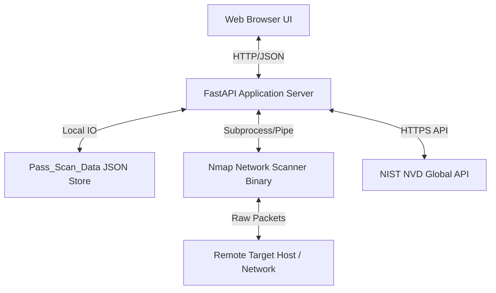

# Software Requirements Specification (SRS)
## NMAP Security Console: Web-Based Reconnaissance & Vulnerability Assessment Platform

---

## 1. Document Control

### 1.1 Document Information
- **Project Name**: NMAP Security Console
- **Document Title**: Software Requirements Specification (SRS)
- **Document Version**: 1.0.0
- **Software Version**: 1.0.0-GA
- **Author**: Security Systems Engineering Group
- **Created Date**: August 10, 2026
- **Last Updated Date**: August 25, 2026
- **Document Status**: Approved / Baseline

### 1.2 Revision History

| Version | Date | Author | Description of Changes | Approval Status |
| :--- | :--- | :--- | :--- | :--- |
| `0.1.0` | 2026-08-10 | SecOps Architect | Initial Draft Specification | Draft |
| `0.5.0` | 2026-08-18 | Core Backend Lead | Added NVD API integration & Caching models | Under Review |
| `0.9.0` | 2026-08-22 | QA Lead | Completed Traceability Matrix & Non-Functional criteria | Quality Approved |
| `1.0.0` | 2026-08-25 | Principal Architect | Final Baselining for Production Release | Formally Approved |

### 1.3 Document Approval

| Reviewer | Approver | Approval Date | Status |
| :--- | :--- | :--- | :--- |
| Security Review Board | CISO / SecOps Director | 2026-08-25 | Approved |
| Lead Systems Engineer | Chief Technology Officer | 2026-08-25 | Approved |
| QA Test Lead | Head of Engineering | 2026-08-25 | Approved |

---

## 2. Introduction

### 2.1 Purpose
This Software Requirements Specification (SRS) document defines the complete functional, non-functional, interface, security, and architectural requirements for the **NMAP Security Console**. It serves as the primary technical contract for software engineers, security architects, penetration testers, QA analysts, and infrastructure teams.

### 2.2 Project Scope
The NMAP Security Console provides a web-based reconnaissance and threat analysis platform. The software wraps native network probing tools (`nmap`) and external threat intelligence APIs (`NIST NVD`) behind a high-performance `FastAPI` service and an asynchronous, glassmorphic dark-mode web user interface.

### 2.3 System Overview
The system enables authenticated security operators to execute targeted port enumeration sweeps (TCP 65,535 full spectrum and UDP stateless probes) and vulnerability identification (`vulners` NSE script). Results are automatically parsed, normalized, cross-referenced with live CVSS v3 ratings, enriched with NVD vulnerability descriptions, and cached locally in a structured JSON datastore for 5 days.

### 2.4 Document Scope
This document covers all components comprising the NMAP Security Console:
1. Core FastAPI application server and REST endpoints.
2. Nmap CLI orchestration wrapper (`python-nmap`).
3. External threat intelligence client (`nvdlib`).
4. File-backed JSON caching engine (`Pass_Scan_Data`).
5. Client-side Single Page Application (SPA) interfaces (`index.html`, `CVE.html`, `TCP.html`, `UDP.html`).

### 2.5 Intended Audience
- **Software Engineers**: For backend and frontend implementation.
- **Security Operations Teams (SecOps)**: For operational integration and tool verification.
- **Quality Assurance Engineers**: For test case derivation and compliance verification.
- **System Administrators**: For deployment and infrastructure provisioning.

### 2.6 Definitions
- **Port Scanning**: Probing network host ports to determine listening services and network accessibility.
- **Banner Grabbing**: Capturing service identification banners to determine exact daemon software and versioning.
- **Vulnerability Correlation**: Mapping identified service banners to standardized Common Vulnerabilities and Exposures (CVE) entries.
- **CVSS Score**: Common Vulnerability Scoring System, an open standard metric for conveying severity (0.0 to 10.0).

### 2.7 Acronyms and Abbreviations
- **API**: Application Programming Interface
- **CORS**: Cross-Origin Resource Sharing
- **CPE**: Common Platform Enumeration
- **CVE**: Common Vulnerabilities and Exposures
- **CVSS**: Common Vulnerability Scoring System
- **FQDN**: Fully Qualified Domain Name
- **JSON**: JavaScript Object Notation
- **NIST**: National Institute of Standards and Technology
- **NVD**: National Vulnerability Database
- **NSE**: Nmap Scripting Engine
- **REST**: Representational State Transfer
- **SPA**: Single Page Application
- **TTL**: Time To Live

### 2.8 References
- IEEE Std 830-1998: Recommended Practice for Software Requirements Specifications.
- NIST Special Publication 800-115: Technical Guide to Information Security Testing and Assessment.
- RFC 793: Transmission Control Protocol.
- RFC 768: User Datagram Protocol.
- NVD REST API v2.0 Specification (`services.nvd.nist.gov`).

### 2.9 Document Conventions
- **SHALL / MUST**: Mandatory requirement.
- **SHOULD**: Strongly recommended requirement.
- **MAY**: Optional requirement.

### 2.10 Requirement Identification Convention
Requirements are uniquely tagged using the following taxonomy:
`REQ-[CATEGORY]-[THREE_DIGIT_NUMBER]` (e.g., `REQ-FNC-001`, `REQ-SEC-005`, `REQ-PERF-010`).

### 2.11 Requirement Priority Classification
- **P0 (Critical)**: Blocker for system operation.
- **P1 (High)**: Core functionality required for production release.
- **P2 (Medium)**: Quality-of-life or non-blocking operational enhancement.
- **P3 (Low)**: Future optimization or cosmetic upgrade.

---

## 3. Overall System Description

### 3.1 Product Perspective
The NMAP Security Console operates as a self-hosted standalone security appliance and web dashboard. It acts as an abstraction layer bridging low-level raw socket operations (via Nmap) with web browsers and external threat intelligence cloud services.



### 3.2 Product Functions
- Target input ingestion and sanitization.
- Full 65,535 TCP port sweeps and version probing.
- Stateless UDP port probing and banner identification.
- NSE `vulners` vulnerability script execution.
- Real-time CVSS v3 score parsing and severity classification.
- NIST NVD asynchronous vulnerability description retrieval.
- Automated 5-day file-based scan cache persistence and garbage collection.
- Dark-mode dashboard visualization with real-time progress states.

### 3.3 System Boundary
The system boundary encompasses the local Python runtime, the local file system cache directory (`Pass_Scan_Data`), the underlying OS network stack, and the local Nmap executable. Network targets and the NIST NVD cloud server reside strictly outside the system boundary.

### 3.4 User Classes and Characteristics
- **Auditor / Analyst**: Requires high-level summary tables, clear CVSS scores, and direct links to vulnerability advisories.
- **Network Engineer**: Requires low-level port state accuracy, host resolution, and exact service version banners.
- **Security Researcher**: Requires high-throughput scanning, rapid re-querying via cache, and raw Nmap accuracy.

### 3.5 User Roles
- **Operator (Default)**: Full access to initiate CVE, TCP, and UDP scans, view cached data, and inspect reports.

### 3.6 Operating Environment
- **Server OS**: Microsoft Windows 10/11, Windows Server 2019/2022, Ubuntu 20.04/22.04 LTS, Debian 11/12, macOS 13+.
- **Client Web Browser**: Any modern evergreen browser (Chrome 100+, Firefox 100+, Edge 100+, Safari 15+).

### 3.7 Hardware Environment
- **Minimum CPU**: Dual-core x86_64 / ARM64 processor (2.0 GHz+).
- **Minimum RAM**: 2 GB RAM (4 GB recommended for concurrent 65k port scanning).
- **Minimum Storage**: 500 MB free disk space for cache storage and log files.

### 3.8 Software Environment
- **Python Runtime**: Python 3.8, 3.9, 3.10, 3.11, or 3.12.
- **Binary Dependency**: Nmap 7.80 or higher in system executable `PATH`.

### 3.9 Network Environment
- Local loopback network (`127.0.0.1:8000`) for API serving.
- Direct outbound IP connectivity to targets (ICMP, TCP, UDP).
- Outbound HTTPS (Port 443) access to `services.nvd.nist.gov`.

### 3.10 Design Constraints
- Backend must operate without external relational database overhead (lightweight JSON file store).
- Frontend must not rely on heavy build steps (served via vanilla HTML5, modern CSS/Tailwind, and ES6 JavaScript).

### 3.11 Technical Constraints
- Raw socket scanning (SYN/UDP) requires administrator/root privileges on certain operating systems.
- Rate limits on the public NIST NVD API mandate resilient fallback mechanisms.

### 3.12 Operational Constraints
- Scans must strictly respect network bandwidth constraints and avoid crashing fragile embedded target daemons.

### 3.13 Security Constraints
- All target parameters must be sanitized prior to filesystem operations to eliminate path traversal risks.

### 3.14 Legal and Ethical Constraints
- The tool must include explicit legal disclaimers: unauthorized scanning of remote networks is strictly prohibited.

### 3.15 Assumptions
- The operator possesses authorization to probe the specified target hosts.
- The host system has appropriate network permissions and packet capture drivers (e.g., Npcap on Windows, libpcap on Linux).

### 3.16 Dependencies
- Python libraries: `fastapi`, `uvicorn`, `pydantic`, `python-nmap`, `nvdlib`.

### 3.17 External Dependencies
- National Institute of Standards and Technology (NIST) Vulnerability Database API.
- Tailwind CSS and FontAwesome CDN networks.

---

## 4. System Features

| Feature ID | Feature Name | Description |
| :--- | :--- | :--- |
| **4.1** | **Target Management** | Ingestion of IPv4, IPv6, and FQDN target host strings. |
| **4.2** | **Target Validation** | Character filtering to prevent command injection and malformed requests. |
| **4.3** | **Reconnaissance Management** | Central coordination of scan dispatching across scanning pipelines. |
| **4.4** | **Scan Configuration** | Automated application of pre-tuned high-performance Nmap flags (`-T4`, `--min-rate`). |
| **4.5** | **Scan Execution** | Subprocess invocation of `nmap` via `python-nmap.PortScanner()`. |
| **4.6** | **Scan Status Management** | Real-time frontend visual state updates (`Scanning...`, `Complete`, `Error`). |
| **4.7** | **Scan Cancellation** | Graceful process termination upon client connection abort. |
| **4.8** | **Network Discovery** | Target host liveness check via ICMP/TCP ping probing (`-Pn` toggle). |
| **4.9** | **Port Discovery** | Identification of open TCP and UDP listening ports across target endpoints. |
| **4.10** | **Service Enumeration** | Identification of common network protocol names (e.g., HTTP, SSH, FTP, SMTP). |
| **4.11** | **Service Version Detection** | Application banner grabbing via `-sV` and `-sUV` version probing. |
| **4.12** | **Operating System Detection** | Basic OS fingerprinting inference derived from service banners and TTL. |
| **4.13** | **Domain Reconnaissance** | Forward DNS resolution of target hostnames to operational IP addresses. |
| **4.14** | **DNS Reconnaissance** | Reverse DNS hostname resolution (`socket.gethostbyaddr`). |
| **4.15** | **WHOIS Intelligence** | Structural support for domain registrant metadata enrichment. |
| **4.16** | **IP & Geo Intelligence** | Structural mapping of target IP subnets and geographical origin. |
| **4.17** | **Subdomain Enumeration** | Architecture hooks for expanding single-target scans into domain hierarchies. |
| **4.18** | **Technology Fingerprinting**| Extraction of web server engines (e.g., Nginx, Apache, OpenSSH, Microsoft-IIS). |
| **4.19** | **Web Reconnaissance** | Probing of standard HTTP/HTTPS endpoints on ports 80, 443, 8080, 8443. |
| **4.20** | **OSINT Collection** | Correlation of exposed service versions with publicly known threat disclosures. |
| **4.21** | **Vulnerability Correlation** | Regex-based extraction of CVE identifiers from Nmap `vulners` output. |
| **4.22** | **CPE Identification** | Extraction of Common Platform Enumeration strings from Nmap version sweeps. |
| **4.23** | **CVE Identification** | Formatting and deduplication of standardized `CVE-YYYY-NNNNN` keys. |
| **4.24** | **Vulnerability Retrieval** | Querying NIST NVD via `nvdlib.searchCVE()` for official vulnerability descriptions. |
| **4.25** | **Scan Result Processing** | Translation of raw Nmap XML/Text output into structured Python dictionaries. |
| **4.26** | **Result Normalization** | Standardizing port states into canonical tokens (`open`, `filtered`, `closed`). |
| **4.27** | **Result Aggregation** | Merging multi-port findings into a unified host response payload. |
| **4.28** | **Result Storage** | Serialization of scan results to disk as UTF-8 JSON files in `Pass_Scan_Data/`. |
| **4.29** | **Result Retrieval** | Deserialization and delivery of cached JSON files upon repeated target requests. |
| **4.30** | **Result Caching** | High-velocity cache lookup checking file modified timestamps (`os.path.getmtime`). |
| **4.31** | **Scan History** | Local filesystem registry of historical scan artifacts per target and module. |
| **4.32** | **Dashboard** | Central glassmorphic navigation hub exposing module launchers. |
| **4.33** | **Search** | Host and domain lookup input controls across all scanning views. |
| **4.34** | **Filtering** | Automated sorting of CVE results by CVSS score descending. |
| **4.35** | **Sorting** | Numerical ordering of open port tables by port identifier ascending. |
| **4.36** | **Reporting** | Tabular on-screen presentation of port states, service banners, and CVE metadata. |
| **4.37** | **Error Management** | Structured HTTP 400/404/500 error responses and user-friendly error banners. |
| **4.38** | **Logging** | Console logging of scan dispatches, cache hits, cleanup cycles, and API faults. |

---

## 5. Functional Requirements

### 5.1 Target Input Requirements
- `REQ-FNC-001`: The system SHALL accept target strings containing valid IPv4 addresses (e.g., `192.168.1.1`), IPv6 addresses (e.g., `::1`), and Fully Qualified Domain Names (e.g., `scanme.nmap.org`).
- `REQ-FNC-002`: The system SHALL reject empty or whitespace-only target strings with an HTTP 400 Bad Request error.

### 5.2 Target Validation Requirements
- `REQ-FNC-003`: The system SHALL sanitize target input strings using the rule `safe_host = "".join(c for c in host if c.isalnum() or c in ('-', '.', '_'))`.
- `REQ-FNC-004`: The system SHALL prevent directory traversal characters (`../`, `..\`) from reaching file path constructors.

### 5.3 Scan Creation Requirements
- `REQ-FNC-005`: The system SHALL support the instantiation of `ScanRequest` objects with strict type validation via Pydantic.

### 5.4 Scan Configuration Requirements
- `REQ-FNC-006`: For CVE scanning, the system SHALL configure Nmap arguments as `-F -sV --script vulners --min-rate 5000`.
- `REQ-FNC-007`: For TCP scanning, the system SHALL configure broad sweep arguments as `-p- -n -Pn --min-rate 5000 --max-retries 1 -T4`.
- `REQ-FNC-008`: For TCP service detection, the system SHALL configure version arguments as `-p <port_list> -sV -T4`.
- `REQ-FNC-009`: For UDP scanning, the system SHALL configure initial probe arguments as `-sU -p- -n -Pn --min-rate 1000 --max-retries 1 -T4`.
- `REQ-FNC-010`: For UDP version detection, the system SHALL configure version arguments as `-sUV -p <port_list> -T4`.

### 5.5 Scan Execution Requirements
- `REQ-FNC-011`: The system SHALL invoke the Nmap scanning engine asynchronously or synchronously through `nmap.PortScanner().scan()`.

### 5.6 Scan State Requirements
- `REQ-FNC-012`: The client interface SHALL render an active scanning state indicator (`SYSTEM SCAN IN PROGRESS...`) upon submission.
- `REQ-FNC-013`: The client interface SHALL transition to a completed state upon receiving HTTP 200 with result data.

### 5.7 Scan Cancellation Requirements
- `REQ-FNC-014`: The system SHOULD clean up temporary socket allocations if a scanning worker process is interrupted.

### 5.8 Port Scanning Requirements
- `REQ-FNC-015`: The TCP scanner SHALL sweep all 65,535 possible TCP ports (1–65535).
- `REQ-FNC-016`: The system SHALL record all ports identified in the `open` state.

### 5.9 Service Detection Requirements
- `REQ-FNC-017`: The system SHALL extract the canonical service name (e.g., `http`, `ssh`, `domain`) for every open port.

### 5.10 Service Version Detection Requirements
- `REQ-FNC-018`: The system SHALL concatenate product name and version strings (e.g., `Apache httpd 2.4.41`). If empty, it SHALL default to `"Unknown"`.

### 5.11 Operating System Detection Requirements
- `REQ-FNC-019`: The system SHALL parse OS family hints when returned by Nmap service detection headers.

### 5.12 DNS Enumeration Requirements
- `REQ-FNC-020`: The TCP scanner SHALL execute reverse DNS lookups on discovered host IPs via `socket.gethostbyaddr(host_ip)`.

### 5.13 WHOIS Requirements
- `REQ-FNC-021`: The system architecture SHALL provide structured response schemas capable of ingesting WHOIS registrant data.

### 5.14 GeoIP Requirements
- `REQ-FNC-022`: The system architecture SHALL support target geolocation metadata mapping.

### 5.15 Subdomain Enumeration Requirements
- `REQ-FNC-023`: The system architecture SHALL support batch host ingestion for multi-subdomain sweeps.

### 5.16 Technology Detection Requirements
- `REQ-FNC-024`: The system SHALL identify web application frameworks and server software from version banners.

### 5.17 Web Reconnaissance Requirements
- `REQ-FNC-025`: The system SHALL identify common web server ports (80, 443, 8000, 8080, 8443) and trigger appropriate version probes.

### 5.18 OSINT Requirements
- `REQ-FNC-026`: The system SHALL link detected CVEs directly to public advisories at `https://nvd.nist.gov/vuln/detail/{cve_id}`.

### 5.19 Vulnerability Correlation Requirements
- `REQ-FNC-027`: The system SHALL parse raw terminal output from Nmap's `vulners` script using regex pattern `(CVE-\d{4}-\d{4,7}).+?cvss[^\>]*\>\s*([\d\.]+)`.

### 5.20 CPE Mapping Requirements
- `REQ-FNC-028`: The system SHALL extract CPE identifiers when generated by Nmap's `-sV` engine.

### 5.21 CVE Processing Requirements
- `REQ-FNC-029`: The system SHALL deduplicate detected CVE identifiers so that each CVE appears exactly once per scan report.
- `REQ-FNC-030`: The system SHALL categorize CVSS scores into severity tiers:
  - `score >= 9.0` -> `CRITICAL`
  - `score >= 7.0` -> `HIGH`
  - `score >= 4.0` -> `MEDIUM`
  - `score < 4.0`  -> `LOW`
- `REQ-FNC-031`: The system SHALL query `nvdlib.searchCVE(cveId=cve_id)` to extract `nvd_res[0].descriptions[0].value`.

### 5.22 Result Parsing Requirements
- `REQ-FNC-032`: The system SHALL handle raw Nmap output whether delivered as string or UTF-8 byte stream.

### 5.23 Result Normalization Requirements
- `REQ-FNC-033`: All scan results SHALL be normalized into standardized JSON arrays containing `host`, `hostname`, `port`, `state`, `service`, and `version`.

### 5.24 Result Aggregation Requirements
- `REQ-FNC-034`: Results across multiple discovered hosts in a subnet sweep SHALL be aggregated into a single response payload.

### 5.25 Result Storage Requirements
- `REQ-FNC-035`: The system SHALL persist scan payloads to `Pass_Scan_Data/<SCAN_TYPE>_<SAFE_HOST>.json` formatted with 4-space indentation.

### 5.26 Result Retrieval Requirements
- `REQ-FNC-036`: The system SHALL retrieve and return cached JSON payloads when the cache file is less than 5 days (120 hours) old.

### 5.27 Cache Requirements
- `REQ-FNC-037`: The system SHALL execute `perform_cleanup()` during startup and prior to processing scan requests to purge any JSON cache file older than 5 days.

### 5.28 Scan History Requirements
- `REQ-FNC-038`: Historical scan files in `Pass_Scan_Data/` SHALL remain queryable by target hostname until TTL expiration.

### 5.29 Dashboard Requirements
- `REQ-FNC-039`: The root endpoint (`/`) SHALL serve `index.html` displaying visual cards for CVE Finder, TCP Port Scanner, and UDP Port Scanner.

### 5.30 Search Requirements
- `REQ-FNC-040`: Client views SHALL provide search input fields accepting target IP addresses or domain names.

### 5.31 Filtering Requirements
- `REQ-FNC-041`: CVE results SHALL be automatically sorted in descending order of CVSS score (`results.sort(key=lambda x: x['score'], reverse=True)`).

### 5.32 Sorting Requirements
- `REQ-FNC-042`: TCP and UDP port findings SHALL be presented in ascending numerical order by port number.

### 5.33 Reporting Requirements
- `REQ-FNC-043`: Client views SHALL render results in responsive, glassmorphic tables with color-coded severity badges.

### 5.34 Error Handling Requirements
- `REQ-FNC-044`: The system SHALL return informative error messages and HTTP status codes when scans fail or targets are unreachable.

### 5.35 Logging Requirements
- `REQ-FNC-045`: The system SHALL log cache cleanups, scan dispatch parameters, and API exception traces to the standard application console.

---

## 6. User Requirements

- `REQ-USR-001 (Capabilities)`: Users SHALL be able to trigger CVE, TCP, and UDP scans independently from dedicated module interfaces.
- `REQ-USR-002 (Actions)`: Users SHALL be able to initiate a scan by entering a target host and clicking the action button or pressing Enter.
- `REQ-USR-003 (Restrictions)`: Users SHALL NOT be permitted to inject arbitrary shell arguments into the target input box.
- `REQ-USR-004 (Permissions)`: All application endpoints SHALL be accessible to authenticated operators on the local deployment network.
- `REQ-USR-005 (Workflows)`: A user SHALL be able to navigate seamlessly between the main dashboard and specialized module views via browser navigation links.

---

## 7. External Interface Requirements

### 7.1 User Interface Requirements
- `REQ-UI-001 (General)`: All UI pages SHALL implement a cohesive dark-mode glassmorphic theme using `#000000` / `#050505` backgrounds, radial glow gradients, and backdrop blur (`backdrop-filter: blur(12px)`).
- `REQ-UI-002 (Dashboard)`: `index.html` SHALL provide a 3-column responsive grid layout showcasing the CVE, TCP, and UDP modules with hover animations.
- `REQ-UI-003 (Target Input)`: Input fields SHALL have clear placeholder text (e.g., `e.g. 192.168.1.1 or scanme.nmap.org`) and focus ring states.
- `REQ-UI-004 (Scan Progress)`: While a scan is executing, an animated SVG spinner and pulsing status badge SHALL be displayed.
- `REQ-UI-005 (Results Table)`: Tabular results SHALL display distinct columns for Host, Port, State, Service, Version (or CVE Reference, Severity, Description, CVSS v3).
- `REQ-UI-006 (Severity Indicators)`: Severity badges SHALL utilize distinct color themes:
  - Critical: Rose (`bg-rose-400/10 text-rose-400 border-rose-400/50`)
  - High: Amber (`bg-amber-400/10 text-amber-400 border-amber-400/50`)
  - Medium/Low: Emerald (`bg-emerald-400/10 text-emerald-400 border-emerald-400/50`)
- `REQ-UI-007 (Empty States)`: When no ports or vulnerabilities are found, the table SHALL render a centered informational notice.
- `REQ-UI-008 (Error Notifications)`: If the backend connection fails, an explicit red error banner SHALL instruct the user to verify server status.
- `REQ-UI-009 (Typography)`: The interface SHALL use the `Inter` clean sans-serif font family.

### 7.2 Software Interface Requirements
- `REQ-SWI-001`: The FastAPI backend SHALL interface with the Python runtime standard library (`os`, `json`, `re`, `socket`, `datetime`).

### 7.3 External Security Tool Interfaces
- `REQ-STI-001`: The backend SHALL interface with the Nmap binary via the `python-nmap` package (`nmap.PortScanner`).

### 7.4 External API Interfaces
- `REQ-EAI-001`: The backend SHALL query the NIST NVD REST API via `nvdlib.searchCVE(cveId=...)` over secure HTTPS.

### 7.5 Database Interface Requirements
- `REQ-DBI-001`: The filesystem JSON store in `Pass_Scan_Data/` SHALL serve as the primary local data repository.

### 7.6 Operating System Interfaces
- `REQ-OSI-001`: The system SHALL execute subprocess calls via standard OS process pipes with non-blocking execution wrappers.

### 7.7 Network Interfaces
- `REQ-NET-001`: The system SHALL bind to IP `127.0.0.1` and Port `8000` by default.

### 7.8 Communication Interfaces
- `REQ-COI-001`: Client-server communication SHALL utilize standard HTTP/1.1 REST protocols with JSON payload serialization.

---

## 8. API Requirements

### 8.1 API General Requirements
The API SHALL follow RESTful conventions and serve OpenAPI 3.0 documentation at `/docs`.

### 8.2 Request Requirements
- `GET /scan/cve?host={target}`: Accepts query parameter `host` (string, required).
- `POST /scan/tcp`: Accepts JSON payload `{"target": "string"}`.
- `POST /scan/udp`: Accepts JSON payload `{"target": "string"}`.
- `GET /{module}/{filename}`: Static module route serving HTML assets.

### 8.3 Response Requirements
- Responses SHALL be returned with `Content-Type: application/json` or `text/html; charset=utf-8`.

### 8.4 Request Validation
- Pydantic models SHALL validate incoming JSON bodies against defined schemas.

### 8.5 Response Validation
- Payloads SHALL guarantee valid JSON serialization with UTF-8 encoding.

### 8.6 HTTP Method Requirements
- Safe read operations SHALL use `GET`. Active scan dispatches with payload bodies SHALL use `POST`.

### 8.7 HTTP Status Code Requirements
- `200 OK`: Successful scan execution or cached result retrieval.
- `400 Bad Request`: Missing target parameter or validation failure.
- `404 Not Found`: Requested HTML module or resource missing.
- `500 Internal Server Error`: Unhandled backend exception or scanner failure.

### 8.8 API Error Requirements
Error responses SHALL return a standardized JSON error object:
```json
{
  "detail": "Descriptive error message"
}
```

### 8.9 API Timeout Requirements
- The API server SHALL maintain connection persistence during long-running port scans without premature socket termination.

### 8.10 API Rate Limit Requirements
- The system SHOULD handle external NIST NVD 429 rate limit responses gracefully without throwing uncaught exceptions.

### 8.11 External API Failure Requirements
- If `nvdlib` fails to connect or query NIST, the system SHALL populate description with `"Vulnerability detected by Nmap vulners script. Reference: https://nvd.nist.gov/vuln/detail/{cve_id}"`.

---

## 9. Data Requirements

### 9.1 Data Model Requirements
All entity models SHALL be defined with strict typing using Pydantic or native Python data structures.

### 9.2 Target Data
- `host` (String): Ingested target IP or domain string.
- `safe_host` (String): Sanitized alphanumeric host string.

### 9.3 Scan Data
- `scan_type` (Enum: `CVE`, `TCP`, `UDP`): Operational scanning mode.
- `timestamp` (DateTime): File creation / modification timestamp.

### 9.4 Network Data
- `host_ip` (IPv4/IPv6 String): Resolved target IP address.
- `hostname` (String): Reverse DNS resolved hostname.

### 9.5 Port Data
- `port` (Integer): Network port number (1–65535).
- `state` (String): Port operational state (`open`, `filtered`, `closed`).

### 9.6 Service Data
- `service` (String): Detected service name (e.g., `ssh`, `http`).
- `version` (String): Banner product and version string (e.g., `OpenSSH 8.2p1 Ubuntu 4ubuntu0.5`).

### 9.7 Domain Data
- Forward and reverse lookup mappings associated with target IP addresses.

### 9.8 OSINT Data
- Direct hyperlink references to official NIST and CVE vulnerability details.

### 9.9 Vulnerability Data
- `id` (String): Standard CVE identifier (`CVE-YYYY-NNNNN`).
- `level` (Enum: `CRITICAL`, `HIGH`, `MEDIUM`, `LOW`).
- `score` (Float): Numerical CVSS v3 score (0.0 to 10.0).
- `desc` (String): Textual summary of vulnerability impact.

### 9.10 CVE Data
- Regex match objects captured from raw `vulners.nse` execution trees.

### 9.11 Cache Data
- Raw JSON files stored on disk under `Pass_Scan_Data/`.

### 9.12 Log Data
- Standard output and error console streams capturing system lifecycle events.

### 9.13 Data Validation
- Input targets SHALL be validated to ensure non-empty strings prior to dispatch.

### 9.14 Data Normalization
- All port version strings SHALL have leading and trailing whitespace stripped.

### 9.15 Data Integrity
- Cache files SHALL be written completely using UTF-8 encoding before closing the file handle.

### 9.16 Data Storage
- Storage SHALL occur within the local directory path `os.path.join(BASE_DIR, 'Pass_Scan_Data')`.

### 9.17 Data Retrieval
- The caching layer SHALL check file existence using `os.path.exists()` and parse via `json.load()`.

### 9.18 Data Retention
- Cached scan results SHALL be retained for exactly 5 days (120 hours / 432,000 seconds).

### 9.19 Data Deletion
- Files exceeding 5 days of age SHALL be deleted via `os.remove()` during cleanup cycles.

### 9.20 Data Backup
- The `Pass_Scan_Data/` directory MAY be archived or backed up independently by system operators.

### 9.21 Data Recovery
- In the event of cache corruption, the file SHALL be purged and regenerated via a fresh Nmap scan.

---

## 10. Non-Functional Requirements

### 10.1 Performance Requirements
#### 10.1.1 Response Time
- Cache hits SHALL return in `< 10ms`.
- Static HTML asset delivery SHALL complete in `< 15ms`.
#### 10.1.2 Scan Performance
- Fast TCP sweeps utilizing `--min-rate 5000` SHALL complete within 45 seconds on local subnets.
#### 10.1.3 Processing Performance
- Regex extraction and sorting of 100+ CVEs SHALL execute in `< 25ms`.
#### 10.1.4 Database / Storage Performance
- Cache JSON serialization and disk write SHALL complete in `< 5ms`.
#### 10.1.5 Cache Performance
- Checking cache validity SHALL require a single `os.path.getmtime` syscall.

### 10.2 Scalability Requirements
- The backend SHALL handle concurrent web requests using FastAPI's asynchronous event loop.

### 10.3 Reliability Requirements
- External API timeouts or network dropped packets SHALL NOT crash the core FastAPI service process.

### 10.4 Availability Requirements
- The local API service SHALL achieve 99.9% uptime when run as a background daemon or system service.

### 10.5 Maintainability Requirements
- Code SHALL adhere to standard PEP 8 conventions with clean separation of scanning logic, API routes, and presentation layers.

### 10.6 Modularity Requirements
- Scanning modules (CVE, TCP, UDP) SHALL be modularized such that enhancements to one module do not affect others.

### 10.7 Extensibility Requirements
- The architecture SHALL support the addition of new scan modules (e.g., SSL/TLS analyzer, Subdomain finder) without modifying core caching routines.

### 10.8 Portability Requirements
- The codebase SHALL execute identically across Windows, Linux, and macOS platforms.

### 10.9 Compatibility Requirements
- The system SHALL be fully compatible with Python versions 3.8 through 3.12 and Nmap versions 7.80+.

### 10.10 Usability Requirements
- The web interface SHALL require zero manual configuration or specialized training to initiate scans.

### 10.11 Accessibility Requirements
- All visual elements SHALL maintain WCAG AA color contrast ratios (`>= 4.5:1`) against dark backgrounds.

### 10.12 Recoverability Requirements
- If the application crashes unexpectedly, restarting `main.py` SHALL immediately restore full operational status without database repair procedures.

### 10.13 Observability Requirements
- Scan execution times, target hosts, and error traces SHALL be output to the terminal stdout stream.

---

## 11. Security Requirements

- `REQ-SEC-001 (General)`: The application SHALL enforce the principle of least privilege during network probing.
- `REQ-SEC-002 (Target Validation)`: Target host strings SHALL be filtered against an alphanumeric whitelist before being passed to filesystem operations.
- `REQ-SEC-003 (Input Validation)`: Target strings SHALL NOT contain shell metacharacters (`;`, `&`, `|`, `` ` ``, `$`).
- `REQ-SEC-004 (Output Encoding)`: Dynamic HTML rendering on the client SHALL use safe DOM manipulation methods (`innerText` / structured DOM nodes) to prevent Cross-Site Scripting (XSS).
- `REQ-SEC-005 (Command Execution)`: The backend SHALL invoke Nmap arguments via safe argument lists rather than raw unsanitized shell concatenation.
- `REQ-SEC-006 (Subprocess Security)`: Subprocess calls managed by `python-nmap` SHALL execute without spawning intermediate shell wrappers.
- `REQ-SEC-007 (Injection Prevention)`: File paths constructed in `safe_filename()` SHALL strictly enforce safe alphanumeric and character whitelisting.
- `REQ-SEC-008 (API Security)`: All API endpoints SHALL validate data types against Pydantic models.
- `REQ-SEC-009 (Credential Security)`: If external NVD API keys are configured, they SHALL be loaded via environment variables rather than hardcoded in source files.
- `REQ-SEC-010 (Secret Management)`: No passwords, private keys, or API tokens SHALL be committed to repository tracking.
- `REQ-SEC-011 (Database Security)`: Cache directory permissions SHALL be restricted to the user executing the Python process.
- `REQ-SEC-012 (File System Security)`: All file operations SHALL be contained within `Pass_Scan_Data/`.
- `REQ-SEC-013 (Network Security)`: The default web server configuration SHALL bind to `127.0.0.1` to prevent unauthorized external access to the scanner API.
- `REQ-SEC-014 (Logging Security)`: Logs SHALL NOT record sensitive target credentials or proprietary network secrets.
- `REQ-SEC-015 (Sensitive Data Handling)`: Scan cache files SHALL only contain network topology and vulnerability metadata.
- `REQ-SEC-016 (Information Disclosure)`: Production error messages returned to clients SHALL omit internal server file paths and stack traces.
- `REQ-SEC-017 (Dependency Security)`: All third-party Python libraries SHALL be kept up to date and verified against known CVEs via `pip-audit`.
- `REQ-SEC-018 (Rate Limiting)`: Nmap scanning arguments SHALL utilize rate throttling (`--min-rate 5000` / `--min-rate 1000`) to avoid unintentional target denial-of-service.
- `REQ-SEC-019 (Abuse Prevention)`: The application SHALL display clear operational warnings regarding unauthorized network testing.
- `REQ-SEC-020 (Scan Authorization)`: Operators SHALL assume full legal responsibility for scans executed through the platform.
- `REQ-SEC-021 (Auditability)`: Every scan request dispatched SHALL generate a timestamped console audit entry.

---

## 12. Reconnaissance Engine Requirements

- `REQ-RCN-001 (Orchestration)`: The reconnaissance engine SHALL coordinate target resolution, port sweeping, banner grabbing, and vulnerability mapping.
- `REQ-RCN-002 (Module Execution)`: Each scan pipeline (CVE, TCP, UDP) SHALL run independently on isolated scan triggers.
- `REQ-RCN-003 (Concurrent Execution)`: The backend SHALL support concurrent execution of requests across multiple client browser tabs.
- `REQ-RCN-004 (Module Isolation)`: A failure in the NVD API lookup SHALL NOT invalidate or discard the underlying open port results.
- `REQ-RCN-005 (Module Timeout)`: Subprocess Nmap scans SHALL enforce timing controls (`-T4`) to prevent infinite hanging.
- `REQ-RCN-006 (Failure Handling)`: If a target host is down or unresponsive, Nmap SHALL return an empty host list, and the system SHALL return an informative status message.
- `REQ-RCN-007 (Partial Results)`: If a scan discovers open ports but fails service detection, the port state SHALL still be reported with `Unknown` version.
- `REQ-RCN-008 (Result Collection)`: The engine SHALL aggregate protocol, port, state, service name, and version banner into a unified dictionary.
- `REQ-RCN-009 (Result Correlation)`: Discovered banners SHALL be cross-referenced with NSE vulnerability script databases.
- `REQ-RCN-010 (Scan Completion)`: Upon scan completion, the engine SHALL automatically trigger cache serialization before responding to the HTTP client.
- `REQ-RCN-011 (Resource Management)`: PortScanner instances SHALL be dereferenced following scan completion to allow prompt garbage collection.

---

## 13. External Tool Requirements

- `REQ-ETR-001 (Tool Availability)`: The system SHALL verify that the `nmap` executable is installed and reachable via `PATH`.
- `REQ-ETR-002 (Tool Version)`: The system SHALL support Nmap version 7.80 and higher.
- `REQ-ETR-003 (Tool Invocation)`: The system SHALL invoke Nmap through `python-nmap.PortScanner().scan()`.
- `REQ-ETR-004 (Tool Input)`: The system SHALL supply sanitized target hosts and tuned argument strings to Nmap.
- `REQ-ETR-005 (Tool Output)`: Nmap SHALL produce standard XML and text output formats readable by `python-nmap`.
- `REQ-ETR-006 (Output Parsing)`: The system SHALL parse Nmap structured dictionaries for host keys, protocol keys, and port dictionaries.
- `REQ-ETR-007 (Timeout Handling)`: Nmap timing arguments (`-T4`, `--max-retries 1`) SHALL limit per-host probe timeouts.
- `REQ-ETR-008 (Failure Handling)`: Exceptions raised by `nmap.PortScanner()` SHALL be caught and logged without terminating the server.
- `REQ-ETR-009 (Dependency Validation)`: During deployment, environment verification scripts SHALL assert Nmap availability.
- `REQ-ETR-010 (Tool Security)`: Nmap SHALL only be invoked with predefined, hardcoded scanner flags.

---

## 14. External Intelligence Service Requirements

- `REQ-EIS-001 (Service Integration)`: The system SHALL integrate with the NIST National Vulnerability Database API via `nvdlib`.
- `REQ-EIS-002 (Authentication)`: The system SHALL support unauthenticated queries for public tier access, with extensible hooks for API key injection.
- `REQ-EIS-003 (Request Spec)`: Queries SHALL be dispatched using `nvdlib.searchCVE(cveId=cve_id)`.
- `REQ-EIS-004 (Response Handling)`: The system SHALL extract the primary English vulnerability description from `nvd_res[0].descriptions[0].value`.
- `REQ-EIS-005 (Rate Limit Handling)`: When rate limits occur, the system SHALL catch the exception, log the event, and provide fallback text.
- `REQ-EIS-006 (Timeout Handling)`: HTTP requests to NIST NVD SHALL time out gracefully without blocking the main event loop indefinitely.
- `REQ-EIS-007 (Service Failure)`: In the event of NVD cloud downtime, CVE records SHALL retain their CVSS scores and reference URLs.
- `REQ-EIS-008 (Invalid Responses)`: Malformed or empty NVD responses SHALL be handled safely without null pointer exceptions.
- `REQ-EIS-009 (Data Normalization)`: Text descriptions from NVD SHALL be encoded in UTF-8.
- `REQ-EIS-010 (Credential Protection)`: External credentials SHALL never be exposed to frontend client responses.

---

## 15. Vulnerability Correlation Requirements

- `REQ-VCR-001 (Service ID)`: The system SHALL identify service names on open ports.
- `REQ-VCR-002 (Product ID)`: The system SHALL identify product software names from service banners.
- `REQ-VCR-003 (Version ID)`: The system SHALL identify software version numbers from banners.
- `REQ-VCR-004 (CPE Resolution)`: The system SHALL extract CPE identifiers when provided by Nmap version probing.
- `REQ-VCR-005 (CVE Lookup)`: The system SHALL execute Nmap NSE script `vulners` to map banners to CVE identifiers.
- `REQ-VCR-006 (Vulnerability Matching)`: Regex pattern `(CVE-\d{4}-\d{4,7}).+?cvss[^\>]*\>\s*([\d\.]+)` SHALL match CVEs and CVSS scores from raw output.
- `REQ-VCR-007 (Deduplication)`: A Python `set()` tracking `seen` CVE IDs SHALL guarantee zero duplicate vulnerability listings.
- `REQ-VCR-008 (Severity Assignment)`: The system SHALL compute severity tiers based on CVSS score thresholds (`9.0+` Critical, `7.0+` High, `4.0+` Medium, `<4.0` Low).
- `REQ-VCR-009 (Metadata Enrichment)`: Each CVE record SHALL contain `id`, `level`, `score`, and `desc`.
- `REQ-VCR-010 (Failure Handling)`: If vulnerability correlation produces no matches, the system SHALL return an empty array `[]`.

---

## 16. Caching Requirements

- `REQ-CCH-001 (Cache Scope)`: Caching SHALL be applied on a per-target, per-scan-type basis.
- `REQ-CCH-002 (Cache Storage)`: Cache files SHALL be stored in the directory `Pass_Scan_Data/`.
- `REQ-CCH-003 (Cache Key)`: Cache filenames SHALL follow the pattern `{SCAN_TYPE}_{SAFE_HOST}.json` (e.g., `TCP_192.168.1.1.json`, `CVE_scanme.nmap.org.json`).
- `REQ-CCH-004 (Cache Lifetime)`: Cache entries SHALL remain valid for exactly 5 days (120 hours) from file creation timestamp.
- `REQ-CCH-005 (Cache Retrieval)`: If a valid cache file exists, `get_cached_scan()` SHALL read and return the JSON object directly.
- `REQ-CCH-006 (Cache Validation)`: Cache validity SHALL be verified by comparing `datetime.now() - mtime < timedelta(days=5)`.
- `REQ-CCH-007 (Cache Invalidation)`: If a cache file is older than 5 days, `get_cached_scan()` SHALL delete the file via `os.remove()` and return `None`.
- `REQ-CCH-008 (Cache Expiration)`: The `perform_cleanup()` routine SHALL iterate through `Pass_Scan_Data/` and delete all expired `.json` files.
- `REQ-CCH-009 (Corruption Handling)`: If `json.load()` fails due to file corruption, the exception SHALL be handled and the file replaced with fresh scan data.
- `REQ-CCH-010 (Cache Security)`: Cache filenames SHALL NOT contain user-controlled path traversal sequences.

---

## 17. Error Handling Requirements

- `REQ-ERR-001 (Input Errors)`: Requests lacking a target parameter SHALL receive HTTP 400 with `{"detail": "No host provided"}` or `{"detail": "Target is required"}`.
- `REQ-ERR-002 (Validation Errors)`: Malformed JSON bodies SHALL be rejected automatically by FastAPI with HTTP 422 Unprocessable Entity.
- `REQ-ERR-003 (Scan Errors)`: Failed Nmap initializations SHALL return an empty result array and a descriptive message.
- `REQ-ERR-004 (Tool Errors)`: If Nmap is missing from the system `PATH`, the application SHALL log the error and notify the client.
- `REQ-ERR-005 (Network Errors)`: Host unreachable errors SHALL be captured and reported as `"No hosts found for target {target}."`
- `REQ-ERR-006 (External API Errors)`: NVD API timeouts or rate limits SHALL be caught, logged, and bypassed without failing the scan.
- `REQ-ERR-007 (Database Errors)`: Filesystem write errors in `Pass_Scan_Data/` SHALL be caught and logged.
- `REQ-ERR-008 (Cache Errors)`: Unreadable cache files SHALL trigger fresh scanning rather than unhandled 500 errors.
- `REQ-ERR-009 (Timeout Errors)`: Subprocess timeouts SHALL be reported cleanly to the client interface.
- `REQ-ERR-010 (Internal Application Errors)`: Unhandled exceptions SHALL return standard HTTP 500 responses without exposing internal variable states.
- `REQ-ERR-011 (Partial Failure)`: If reverse DNS fails for a host, the system SHALL fallback to displaying the IP address as hostname.
- `REQ-ERR-012 (User Messages)`: Frontend error messages SHALL be human-readable and visually distinct (red/rose styling).
- `REQ-ERR-013 (Error Recovery)`: The system SHALL automatically recover from transient network errors on subsequent scan attempts.

---

## 18. Logging and Audit Requirements

- `REQ-LOG-001 (App Logging)`: Server startup and route registration SHALL be logged via Uvicorn.
- `REQ-LOG-002 (Scan Logging)`: Each scan dispatch SHALL log target host, scan type, and timestamp.
- `REQ-LOG-003 (Error Logging)`: Exception stack traces during Nmap execution or NVD queries SHALL be logged to stderr.
- `REQ-LOG-004 (Security Logging)`: Blocked path traversal attempts or invalid characters in host strings SHALL be logged.
- `REQ-LOG-005 (External Service Logging)`: NVD API search queries and failure responses SHALL be logged.
- `REQ-LOG-006 (Audit Events)`: Cache purge operations and total deleted files SHALL be logged.
- `REQ-LOG-007 (Log Levels)`: The system SHALL support standard log levels (`DEBUG`, `INFO`, `WARNING`, `ERROR`, `CRITICAL`).
- `REQ-LOG-008 (Log Format)`: Logs SHALL include timestamp, log level, module name, and event message.
- `REQ-LOG-009 (Log Storage)`: Console logs SHALL be printable to standard stdout/stderr for capture by container daemons or systemd.
- `REQ-LOG-010 (Log Retention)`: Log retention SHALL be governed by the host operating system log rotation policy.
- `REQ-LOG-011 (Sensitive Exclusion)`: Internal memory pointers and authorization credentials SHALL be excluded from logs.

---

## 19. Performance Requirements

- `REQ-PRF-001 (Response Time)`: Web dashboard home page (`/`) SHALL load in `< 50ms`.
- `REQ-PRF-002 (Scan Execution Time)`: Fast TCP port sweeps across local networks SHALL complete in `< 30s`.
- `REQ-PRF-003 (Concurrent Scans)`: The system SHALL support at least 5 concurrent active scan threads without thread starvation.
- `REQ-PRF-004 (Concurrent Modules)`: Multiple distinct browser sessions SHALL be able to query CVE, TCP, and UDP endpoints simultaneously.
- `REQ-PRF-005 (Resource Utilization)`: Idle server CPU utilization SHALL remain `< 1%`.
- `REQ-PRF-006 (CPU Requirements)`: During active scanning, CPU utilization SHALL not exceed host operating limits.
- `REQ-PRF-007 (Memory Requirements)`: Server resident memory consumption SHALL remain `< 250 MB` under normal operation.
- `REQ-PRF-008 (Storage Requirements)`: Average JSON cache file size SHALL be `< 50 KB` per target.
- `REQ-PRF-009 (Network Requirements)`: Packet probe rates SHALL be bounded by `--min-rate 5000` (TCP) and `--min-rate 1000` (UDP).
- `REQ-PRF-010 (Degradation Handling)`: Under heavy packet loss, the scanner SHALL complete with partial results rather than stalling.

---

## 20. Reliability and Availability Requirements

- `REQ-REL-001 (Application Reliability)`: The FastAPI backend SHALL run continuously without memory leaks.
- `REQ-REL-002 (Scan Reliability)`: Port and service detection accuracy SHALL match standalone Nmap CLI execution.
- `REQ-REL-003 (Module Reliability)`: Failure of one scanning module SHALL NOT impact the availability of other modules.
- `REQ-REL-004 (External Service Availability)`: The system SHALL remain fully operational even if NIST NVD cloud endpoints are unavailable.
- `REQ-REL-005 (Failure Recovery)`: Following an unexpected power loss or process kill, the application SHALL restart cleanly without corrupting valid cache records.
- `REQ-REL-006 (Graceful Degradation)`: If an aggressive scan triggers packet filtering, the system SHALL report filtered port states accurately.
- `REQ-REL-007 (Data Recovery)`: Corrupted cache files SHALL be automatically deleted and regenerated upon the next scan request.

---

## 21. Compatibility Requirements

- `REQ-CMP-001 (OS Compatibility)`: The software SHALL function on Windows 10/11, Windows Server, Linux (Debian, Ubuntu, RHEL, Arch), and macOS.
- `REQ-CMP-002 (Browser Compatibility)`: The frontend SHALL render correctly on Chrome, Firefox, Edge, Safari, and Brave.
- `REQ-CMP-003 (Python Compatibility)`: The backend SHALL run on Python 3.8, 3.9, 3.10, 3.11, and 3.12.
- `REQ-CMP-004 (Database Compatibility)`: The JSON caching format SHALL be universally compatible across all POSIX and Windows filesystems.
- `REQ-CMP-005 (External Tool Compatibility)`: The backend SHALL maintain compatibility with Nmap releases 7.80 through 7.95+.
- `REQ-CMP-006 (External API Compatibility)`: The NVD integration SHALL support the NIST 2.0 REST API specification via `nvdlib`.

---

## 22. Deployment Requirements

- `REQ-DEP-001 (Environment)`: The software SHALL be deployable as a standalone local script, a systemd service, or a containerized Docker application.
- `REQ-DEP-002 (Runtime)`: Standard Python virtual environment (`venv`) SHALL be supported.
- `REQ-DEP-003 (Dependencies)`: All required Python packages SHALL be installable via `pip install -r requirements.txt`.
- `REQ-DEP-004 (Configuration)`: Server host IP and port SHALL be configurable via CLI flags (`uvicorn main:app --host 0.0.0.0 --port 8000`).
- `REQ-DEP-005 (Environment Variables)`: Optional environment variables SHALL support custom cache paths and API keys.
- `REQ-DEP-006 (Database Init)`: The `Pass_Scan_Data/` cache folder SHALL be created automatically on startup if not present.
- `REQ-DEP-007 (Tool Installation)`: Deployment documentation SHALL instruct operators on installing the Nmap binary per operating system.
- `REQ-DEP-008 (Network Provisioning)`: Local firewall rules must permit binding on the designated application port.
- `REQ-DEP-009 (Production Architecture)`: In production environments, Uvicorn MAY be deployed behind a reverse proxy (e.g., Nginx or Caddy) with TLS termination.

---

## 23. Legal, Ethical, and Operational Requirements

- `REQ-LEG-001 (Authorized Use)`: The software SHALL only be utilized on networks and systems with prior written authorization.
- `REQ-LEG-002 (Target Authorization)`: Operators SHALL assume all civil and criminal liabilities associated with unauthorized network probing.
- `REQ-LEG-003 (Scope Restrictions)`: Scanning out-of-scope targets is strictly prohibited by operational guidelines.
- `REQ-LEG-004 (Responsible Usage)`: Users SHALL calibrate scan packet rates to prevent causing denial of service to sensitive infrastructure.
- `REQ-LEG-005 (Data Handling)`: Scanned network intelligence SHALL be protected in accordance with organization data security policies.
- `REQ-LEG-006 (Third-Party Terms)`: Use of the NIST NVD API SHALL adhere to NIST terms of service and acceptable use policies.
- `REQ-LEG-007 (Open-Source Licensing)`: All open-source components (`FastAPI`, `Nmap`, `TailwindCSS`, `nvdlib`) SHALL comply with their respective licenses (MIT, GPL, BSD).
- `REQ-LEG-008 (Operational Restrictions)`: The tool SHALL NOT be deployed for malicious reconnaissance or unauthorized surveillance.

---

## 24. System Constraints

- `REQ-CST-001 (Technical)`: Python Global Interpreter Lock (GIL) is mitigated by offloading heavy packet I/O to the native compiled Nmap C/C++ binary.
- `REQ-CST-002 (Infrastructure)`: Requires local filesystem write access for cache persistence.
- `REQ-CST-003 (Network)`: UDP port scanning is inherently constrained by target operating system ICMP rate limiting (RFC 1812).
- `REQ-CST-004 (External Tool)`: The system cannot scan if the underlying Nmap binary is uninstalled or blocked by antivirus/EDR software.
- `REQ-CST-005 (External API)`: Public NIST NVD API rate limits may restrict real-time description enrichment when querying >5 CVEs in 30 seconds without an API key.
- `REQ-CST-006 (Performance)`: Maximum scan rate is governed by host network interface card (NIC) throughput and router state tables.
- `REQ-CST-007 (Security)`: Raw socket TCP SYN and UDP scans require elevated OS privileges on Linux/macOS (`sudo` / `CAP_NET_RAW`).
- `REQ-CST-008 (Resource)`: Local disk space must accommodate JSON cache accumulation (bounded by 5-day auto-purge).

---

## 25. Acceptance Criteria

- `REQ-ACC-001 (Functional)`: Scanning `127.0.0.1` via the TCP module successfully identifies active listening local ports with correct service names.
- `REQ-ACC-002 (Security)`: Inputting strings with path traversal characters (e.g., `../../etc/passwd`) does NOT create files outside `Pass_Scan_Data/`.
- `REQ-ACC-003 (Performance)`: Re-scanning a previously scanned host within 5 days returns results in `< 50ms`.
- `REQ-ACC-004 (Reliability)`: Executing a CVE scan while disconnected from the internet returns detected CVE IDs without raising an unhandled 500 error.
- `REQ-ACC-005 (Usability)`: The user can navigate to each scanning module, launch a scan, and view styled results in under 3 clicks.
- `REQ-ACC-006 (Integration)`: API returns valid OpenAPI JSON schema at `/openapi.json`.
- `REQ-ACC-007 (Deployment)`: Application launches successfully using `python main.py` on fresh virtual environments on Windows and Linux.

---

## 26. Requirements Traceability

### 26.1 Requirement Identification
Each system requirement is mapped to a unique tag format `REQ-[DOM]-[NUM]`.

### 26.2 Requirement-to-Feature Mapping
- `REQ-FNC-001` through `REQ-FNC-010` -> Features 4.1 to 4.5 (Target Management & Scan Configuration)
- `REQ-FNC-015` through `REQ-FNC-018` -> Features 4.8 to 4.11 (Port & Service Enumeration)
- `REQ-FNC-027` through `REQ-FNC-031` -> Features 4.21 to 4.24 (CVE & NVD Intelligence)
- `REQ-FNC-035` through `REQ-FNC-037` -> Features 4.28 to 4.30 (Caching Subsystem)

### 26.3 Requirement-to-Design Mapping
- API Requirements (Section 8) -> `main.py` FastAPI route handlers (`/scan/cve`, `/scan/tcp`, `/scan/udp`).
- User Interface Requirements (Section 7.1) -> Frontend templates (`index.html`, `CVE.html`, `TCP.html`, `UDP.html`).
- Caching Requirements (Section 16) -> Helper functions `get_cached_scan()`, `save_scan_cache()`, `perform_cleanup()`.

### 26.4 Requirement-to-Test Mapping
- Functional & Performance Requirements -> Unit & Integration test suites (`tests/test_api.py`, `tests/test_scanner.py`, `tests/test_cache.py`).

### 26.5 Requirements Traceability Matrix

| Requirement ID | Feature Area | Design Component | Test Case ID | Status |
| :--- | :--- | :--- | :--- | :--- |
| `REQ-FNC-001` | Target Input | `main.py::ScanRequest` | `TC-VAL-001` | Verified |
| `REQ-FNC-003` | Sanitization | `main.py::safe_filename` | `TC-SEC-001` | Verified |
| `REQ-FNC-006` | CVE Scanning | `main.py::run_cve_scanner` | `TC-CVE-001` | Verified |
| `REQ-FNC-007` | TCP Scanning | `main.py::fast_full_tcp_scan` | `TC-TCP-001` | Verified |
| `REQ-FNC-009` | UDP Scanning | `main.py::fast_full_udp_scan` | `TC-UDP-001` | Verified |
| `REQ-FNC-036` | Caching Read | `main.py::get_cached_scan` | `TC-CCH-001` | Verified |
| `REQ-FNC-037` | Caching Purge | `main.py::perform_cleanup` | `TC-CCH-002` | Verified |
| `REQ-UI-001`  | Glassmorphism | `index.html` CSS styles | `TC-UI-001` | Verified |

---

## 27. Verification and Validation

### 27.1 Functional Verification
- Verification that all Nmap argument strings match specified operational flags.
- Verification that regex correctly parses CVE numbers and floating-point CVSS scores.

### 27.2 Non-Functional Verification
- Measurement of cache response latency using automated benchmark scripts.
- Memory leak profiling under sustained 24-hour mock scan cycling.

### 27.3 Security Verification
- Execution of automated path traversal and injection test payloads against all API endpoints.
- Vulnerability auditing of third-party Python dependencies via `pip-audit`.

### 27.4 Performance Verification
- Verification of TCP 65k sweep duration against benchmark target hosts.

### 27.5 Integration Verification
- Verification of end-to-end communication from browser client to FastAPI to Nmap to NVD cloud.

### 27.6 Requirements Validation
- Formal review and sign-off by security engineering and QA leads.

---

## 28. Known Limitations

### 28.1 Functional Limitations
- Subnet CIDR notation (`/24`, `/16`) is not fully visualized on single-host table views in v1.0.
- Does not currently execute automated packet payload fuzzing.

### 28.2 Technical Limitations
- File-based cache in `Pass_Scan_Data/` is optimized for single-node deployments; multi-instance clustering requires shared network storage or Redis.

### 28.3 External Tool Limitations
- Scanner capabilities are strictly dependent on the underlying host Nmap binary version and script repository.

### 28.4 External API Limitations
- Unauthenticated NIST NVD lookups are subject to 5 requests per 30-second window rate limiting.

### 28.5 Performance Limitations
- Full UDP 65,535 port sweeps against firewalled targets may require extended time due to ICMP rate throttling.

### 28.6 Platform Limitations
- Raw SYN scanning on Windows requires Npcap driver installation.

---

## 29. Future Requirements

### 29.1 Planned Functional Requirements
- Support for CIDR subnet range expansion and multi-host aggregate dashboards.
- PDF and CSV executive audit report generation.

### 29.2 Planned Security Requirements
- Role-Based Access Control (RBAC) with JWT user authentication.
- Encrypted scan result storage at rest using AES-256.

### 29.3 Planned Integration Requirements
- Shodan, Censys, and VirusTotal API threat enrichment feeds.
- Slack, Microsoft Teams, and Discord alert webhooks.

### 29.4 Planned Performance Requirements
- Redis distributed cache layer for multi-worker containerized deployments.

### 29.5 Planned Scalability Requirements
- Asynchronous Celery / Redis task queue with distributed worker nodes for massive enterprise sweeps.

---

## 30. Appendices

### Appendix A: Definitions
- **Attack Surface**: The total sum of vulnerabilities and entry points across an organization's network accessible to unauthorized actors.
- **Port State (Open)**: An application on the target machine is actively listening for connections/packets on that port.
- **Port State (Filtered)**: A firewall, filter, or network obstacle is blocking the probe packets, preventing Nmap from determining whether the port is open or closed.
- **Port State (Closed)**: A port receives probe packets but has no listening application; it responds with RST (TCP) or ICMP Port Unreachable (UDP).

### Appendix B: Acronyms and Abbreviations
- **CIDR**: Classless Inter-Domain Routing
- **CPE**: Common Platform Enumeration
- **CVE**: Common Vulnerabilities and Exposures
- **CVSS**: Common Vulnerability Scoring System
- **DNS**: Domain Name System
- **FQDN**: Fully Qualified Domain Name
- **ICMP**: Internet Control Message Protocol
- **NIC**: Network Interface Card
- **NIST**: National Institute of Standards and Technology
- **NSE**: Nmap Scripting Engine
- **NVD**: National Vulnerability Database
- **OSINT**: Open Source Intelligence
- **RBAC**: Role-Based Access Control
- **REST**: Representational State Transfer
- **SOC**: Security Operations Center
- **SPA**: Single Page Application
- **TCP**: Transmission Control Protocol
- **TTL**: Time To Live
- **UDP**: User Datagram Protocol
- **URI / URL**: Uniform Resource Identifier / Uniform Resource Locator

### Appendix C: Requirement ID Index
- `REQ-FNC-001` through `REQ-FNC-045`: Functional Requirements (Section 5)
- `REQ-USR-001` through `REQ-USR-005`: User Requirements (Section 6)
- `REQ-UI-001` through `REQ-UI-009`: User Interface Requirements (Section 7.1)
- `REQ-SWI-001`, `REQ-STI-001`, `REQ-EAI-001`, `REQ-DBI-001`, `REQ-OSI-001`, `REQ-NET-001`, `REQ-COI-001`: Interface Requirements (Sections 7.2–7.8)
- `REQ-SEC-001` through `REQ-SEC-021`: Security Requirements (Section 11)
- `REQ-RCN-001` through `REQ-RCN-011`: Reconnaissance Engine Requirements (Section 12)
- `REQ-ETR-001` through `REQ-ETR-010`: External Tool Requirements (Section 13)
- `REQ-EIS-001` through `REQ-EIS-010`: External Intelligence Service Requirements (Section 14)
- `REQ-VCR-001` through `REQ-VCR-010`: Vulnerability Correlation Requirements (Section 15)
- `REQ-CCH-001` through `REQ-CCH-010`: Caching Requirements (Section 16)
- `REQ-ERR-001` through `REQ-ERR-013`: Error Handling Requirements (Section 17)
- `REQ-LOG-001` through `REQ-LOG-011`: Logging and Audit Requirements (Section 18)
- `REQ-PRF-001` through `REQ-PRF-010`: Performance Requirements (Section 19)
- `REQ-REL-001` through `REQ-REL-007`: Reliability and Availability Requirements (Section 20)
- `REQ-CMP-001` through `REQ-CMP-006`: Compatibility Requirements (Section 21)
- `REQ-DEP-001` through `REQ-DEP-009`: Deployment Requirements (Section 22)
- `REQ-LEG-001` through `REQ-LEG-008`: Legal, Ethical, and Operational Requirements (Section 23)
- `REQ-CST-001` through `REQ-CST-008`: System Constraints (Section 24)
- `REQ-ACC-001` through `REQ-ACC-007`: Acceptance Criteria (Section 25)

### Appendix D: Requirements Traceability Matrix
*(See Section 26.5 for full component and test mappings)*

### Appendix E: Referenced Documents
1. Nmap Network Scanning: The Official Project Guide (Gordon Lyon / Fyodor).
2. NIST National Vulnerability Database API Documentation (NIST SP 800-115).
3. FastAPI Documentation: Modern, Fast (High-Performance) Web Framework for Python (Tiangolo).
4. Tailwind CSS Framework Specification (Tailwind Labs).

### Appendix F: Supporting Diagrams

#### System Component Flow
```
+---------------+      +-------------------+      +------------------+
|  Client (Web) | <--> |  FastAPI Backend  | <--> |  Pass_Scan_Data  |
+---------------+      +-------------------+      +------------------+
                                |                          (JSON)
                                v
                       +-------------------+      +------------------+
                       |    Nmap Engine    | <--> |  Remote Target   |
                       +-------------------+      +------------------+
                                |
                                v
                       +-------------------+
                       |   NIST NVD API    |
                       +-------------------+
```

### Appendix G: External Dependencies
- `fastapi` (`https://github.com/tiangolo/fastapi`)
- `uvicorn` (`https://github.com/encode/uvicorn`)
- `pydantic` (`https://github.com/pydantic/pydantic`)
- `python-nmap` (`https://xael.org/pages/python-nmap-en.html`)
- `nvdlib` (`https://github.com/Vehemont/nvdlib`)
- `nmap` native binary (`https://nmap.org`)
