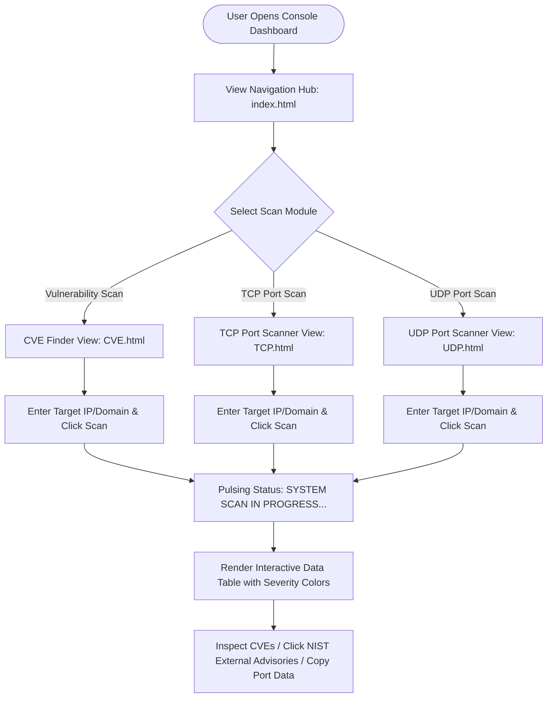

# UI/UX Design System & Specification
## NMAP Security Console: Interface Design & User Experience Specification

---

## 1. Document Information

| Attribute | Details |
| :--- | :--- |
| **Project Name** | NMAP Security Console |
| **Document Title** | UI/UX Design System & Specification Document |
| **Document Version** | 1.0.0 |
| **Author** | Lead UI/UX Designer & Frontend Engineer |
| **Date** | August 25, 2026 |
| **Status** | Approved / Design Baseline |

### Revision History

| Version | Date | Author | Description of Changes | Status |
| :--- | :--- | :--- | :--- | :--- |
| `0.1.0` | 2026-08-14 | UI Designer | Initial Wireframes & Glassmorphic Palette Definition | Draft |
| `0.8.0` | 2026-08-21 | Frontend Lead | Completed Component Library & State Transitions | Under Review |
| `1.0.0` | 2026-08-25 | UX Review Board | Formally Approved for Release Baseline | Approved |

---

## 2. UX Overview

The **NMAP Security Console** interface is built around the principles of **cyberpunk glassmorphism, visual hierarchy, high cognitive clarity, and low-latency interaction**. Security analysts and network engineers require instantaneous visual clarity when parsing critical threat data. The user interface translates complex network socket scans and CVE telemetry into color-coded, prioritized, readable data tables.

---

## 3. Design Goals

- **DG-1 (Visual Hierarchy)**: Direct operator focus immediately to critical vulnerability scores and open attack vectors.
- **DG-2 (Zero Cognitive Friction)**: Enable single-click scan execution from input to report generation.
- **DG-3 (Aesthetic Sophistication)**: Deliver an ultra-modern, dark-mode cybersecurity operations center aesthetic using glassmorphic surfaces, glow effects, and smooth micro-animations.
- **DG-4 (High Readability)**: Ensure high contrast across dark slate backgrounds (`#000000`, `#050505`) with WCAG AA compliance.

---

## 4. Design Principles

1. **Information-First Layout**: Eliminate decorative clutter in data views; tabular results take center stage.
2. **Contextual Color Semantics**: Use universally recognized severity colors (Red for Critical, Amber for High, Emerald for Low/Open).
3. **Pulsing Liveness Feedback**: Provide animated visual cues while long-running scans execute.
4. **Resilient State Management**: Explicitly render loading, empty, success, and error states for all user actions.

---

## 5. Target Users & Personas

- **Security Analyst (Primary)**: Needs fast CVE breakdowns and direct links to NIST CVE documentation.
- **Network Engineer (Secondary)**: Needs clear port status (`open`, `filtered`), detected service names, and software version banners.

---

## 6. User Journey & User Flows



---

## 7. Information Architecture & Site Map

```
NMAP Security Console (Root /)
│
├── Dashboard (index.html)
│    ├── Hero Header & System Status Indicator
│    └── Module Selector Cards (CVE, TCP, UDP)
│
├── CVE Finder (/CVE_CVSS/CVE.html)
│    ├── Target Host Input & "Start Live Scan" Action
│    ├── Pulsing Status Banner
│    └── Detected Vulnerabilities Table (CVE, Severity, Description, CVSS Score)
│
├── TCP Port Scanner (/TCP_Scan/TCP.html)
│    ├── Target Host Input & "Scan Ports" Action
│    ├── Live Progress Indicator
│    └── Detected Ports Table (Host, Port/TCP, State, Service, Version)
│
└── UDP Port Scanner (/UDP_Scan/UDP.html)
     ├── Target Host Input & "Scan UDP Ports" Action
     ├── Probing Status Indicator with Duration Warning
     └── Detected Ports Table (Host, Port/UDP, State, Service, Version)
```

---

## 8. Screen Inventory & Specifications

### 8.1 Dashboard Hub (`index.html`)
- **Dimensions**: Max container width `1152px` (`max-w-6xl`), centered.
- **Hero Section**: Glowing radar icon (`fas fa-radar text-cyan-400`), gradient title text (`bg-clip-text from-white via-cyan-100 to-cyan-400`), subtitle description.
- **Card Grid**: 3-column responsive grid (`grid-cols-1 md:grid-cols-3 gap-8`).
- **Footer**: Glassmorphic status pill with pulsing emerald indicator (`System Operational`).

### 8.2 CVE Finder Screen (`CVE_CVSS/CVE.html`)
- **Header**: Icon badge (`fas fa-triangle-exclamation text-cyan-400`), title, and dynamic scan progress badge (`scanStatus`).
- **Input Panel**: Glassmorphic card containing target text input and bold action button (`Start Live Scan`).
- **Results Container**: Glass card wrapping dynamic table with columns: `CVE Reference`, `Severity`, `Description`, `CVSS v3`.

### 8.3 TCP & UDP Scanner Screens (`TCP.html`, `UDP.html`)
- **Header**: Module-specific icons (`fas fa-laptop-code`, `fas fa-server`).
- **Input Panel**: Target IP/Domain input with focus ring and scan trigger button.
- **Results Container**: Dynamic table displaying `Host`, `Port`, `State`, `Service`, `Version`.

---

## 9. Design System Specifications

### 9.1 Color System

| Token | Hex Value | RGBA / Usage | Preview |
| :--- | :--- | :--- | :--- |
| `--bg-base` | `#000000` / `#050505` | Canvas background | Dark Onyx |
| `--bg-radial` | `#1a1a2e` | Radial glow overlay | Deep Midnight Glow |
| `--panel-glass` | `rgba(25, 30, 45, 0.4)` | Glass card background | Translucent Slate |
| `--border-glass` | `rgba(255, 255, 255, 0.08)` | Glass borders | Subtle Frosted Border |
| `--cyan-primary` | `#06b6d4` | Primary brand accent / active highlights | Cyber Cyan |
| `--cyan-glow` | `rgba(6, 182, 212, 0.5)` | Text and box shadow glows | Neon Cyan Glow |
| `--severity-critical` | `#f43f5e` | `text-rose-400` / CVSS >= 9.0 | Neon Rose |
| `--severity-high` | `#fbbf24` | `text-amber-400` / CVSS 7.0–8.9 | Cyber Amber |
| `--severity-low` | `#34d399` | `text-emerald-400` / CVSS < 4.0 / Open Ports | Cyber Emerald |
| `--text-primary` | `#ffffff` | Primary headings & high-contrast titles | Pure White |
| `--text-muted` | `#94a3b8` | Subtitles, table headers, descriptions | Slate 400 |

### 9.2 Typography System

```css
font-family: 'Inter', system-ui, -apple-system, BlinkMacSystemFont, 'Segoe UI', Roboto, sans-serif;
```

| Element | Size | Weight | Line Height | Tracking |
| :--- | :--- | :--- | :--- | :--- |
| **Hero Title (H1)** | `3.75rem` (`60px`) | `900 (Black)` | `1.1` | `-0.025em` |
| **Module Title (H2)** | `1.5rem` (`24px`) | `700 (Bold)` | `1.3` | `Normal` |
| **Section Header (H3)** | `1.125rem` (`18px`) | `700 (Bold)` | `1.4` | `Normal` |
| **Body Text** | `0.875rem` (`14px`) | `400 (Regular)` | `1.6` | `Normal` |
| **Table Header** | `0.625rem` (`10px`) | `900 (Black)` | `1.2` | `0.1em (Uppercase)` |
| **Port / CVE Code** | `0.875rem` (`14px`) | `700 (Mono Bold)` | `1.2` | `-0.025em` |

### 9.3 Glassmorphism System

```css
.glass-panel {
    background: rgba(25, 30, 45, 0.4);
    backdrop-filter: blur(12px);
    -webkit-backdrop-filter: blur(12px);
    border: 1px solid rgba(255, 255, 255, 0.08);
    box-shadow: 0 25px 50px -12px rgba(0, 0, 0, 0.5);
}

.glass-card {
    background: rgba(255, 255, 255, 0.03);
    backdrop-filter: blur(10px);
    border: 1px solid rgba(255, 255, 255, 0.1);
}
```

---

## 10. Component Library

### 10.1 Buttons
- **Action Button (`Start Live Scan`)**: `bg-white hover:bg-cyan-400 text-black px-10 py-4 rounded-xl font-black uppercase tracking-tighter transition-all hover:scale-105`
- **Module Card Button (`Launch Module`)**: `text-cyan-400 text-sm font-bold uppercase tracking-wider group-hover:translate-x-2 transition-transform`

### 10.2 Input Fields
- **Target Search Bar**: `bg-white/5 border border-white/10 p-4 rounded-xl focus:outline-none focus:ring-2 focus:ring-cyan-500 text-white placeholder-slate-600`

### 10.3 Tables
- **Container**: Glass card with `overflow-hidden` and `overflow-x-auto`.
- **Headers**: `bg-white/5 text-slate-500 text-[10px] uppercase font-black tracking-widest px-8 py-5`.
- **Row Hover**: `hover:bg-white/[0.02] transition-colors group`.
- **Dividers**: `divide-y divide-white/5`.

### 10.4 Badges & Severity Chips
- **Critical Chip**: `px-3 py-1 rounded-md border text-[10px] font-black text-rose-400 border-rose-400/50 bg-rose-400/10`
- **High Chip**: `px-3 py-1 rounded-md border text-[10px] font-black text-amber-400 border-amber-400/50 bg-amber-400/10`
- **Open Port / Low Chip**: `px-3 py-1 rounded-md border text-[10px] font-black text-emerald-400 border-emerald-400/50 bg-emerald-400/10`

### 10.5 Status Indicators
- **Active Scanning Indicator**: `bg-cyan-500/10 text-cyan-400 px-5 py-2 rounded-full border border-cyan-500/30 animate-pulse` with spinning SVG icon.

---

## 11. State Transitions & UI Patterns

```
+-------------------------------------------------------------------------------+
|                            STATE TRANSITIONS                                  |
+-------------------------------------------------------------------------------+
| State          | Visual Representation                                        |
+----------------+--------------------------------------------------------------+
| Initial / Empty| Table renders italic placeholder: "Awaiting target input..." |
| Loading / Scan | Status badge pulses; Table displays pulsing cyan target banner|
| Success Results| Table dynamically populates with color-coded rows            |
| Zero Findings  | Informational row: "No open ports / CVEs found for host"     |
| Error / Fault  | High-contrast rose message: "Failed to connect to backend..." |
+-------------------------------------------------------------------------------+
```

---

## 12. Responsive Design Specifications

- **Mobile Viewports (`< 768px`)**:
  - Module cards stack vertically in a 1-column layout.
  - Search input and scan button stack vertically (`flex-col`).
  - Tables enable smooth horizontal scrolling (`overflow-x-auto`).
- **Tablet Viewports (`768px – 1024px`)**:
  - Search bar and button align horizontally (`flex-row`).
  - Card grid scales to 2 or 3 columns with condensed padding.
- **Desktop Viewports (`> 1024px`)**:
  - Full 3-column card grid (`max-w-5xl` / `max-w-6xl`).
  - Ample padding (`p-8`, `px-8 py-6`) for effortless readability.

---

## 13. Accessibility & Usability (WCAG 2.1 AA)

- **Keyboard Navigation**: All inputs and buttons are focusable via `Tab` with visible outline focus rings (`focus:ring-2 focus:ring-cyan-500`).
- **Contrast Ratios**: All text tokens surpass WCAG AA standard `>= 4.5:1` against dark backgrounds.
- **Semantic Structure**: Proper `<h1>`, `<h2>`, `<main>`, `<header>`, `<table>`, `<thead>`, `<tbody>` markup.

---

## 14. Approval and Sign-off

| Role | Name | Signature | Date |
| :--- | :--- | :--- | :--- |
| **Lead UX Architect** | M. Ross | *Approved (Digital)* | 2026-08-25 |
| **Senior Frontend Engineer** | Y. Jamad | *Approved (Digital)* | 2026-08-25 |
